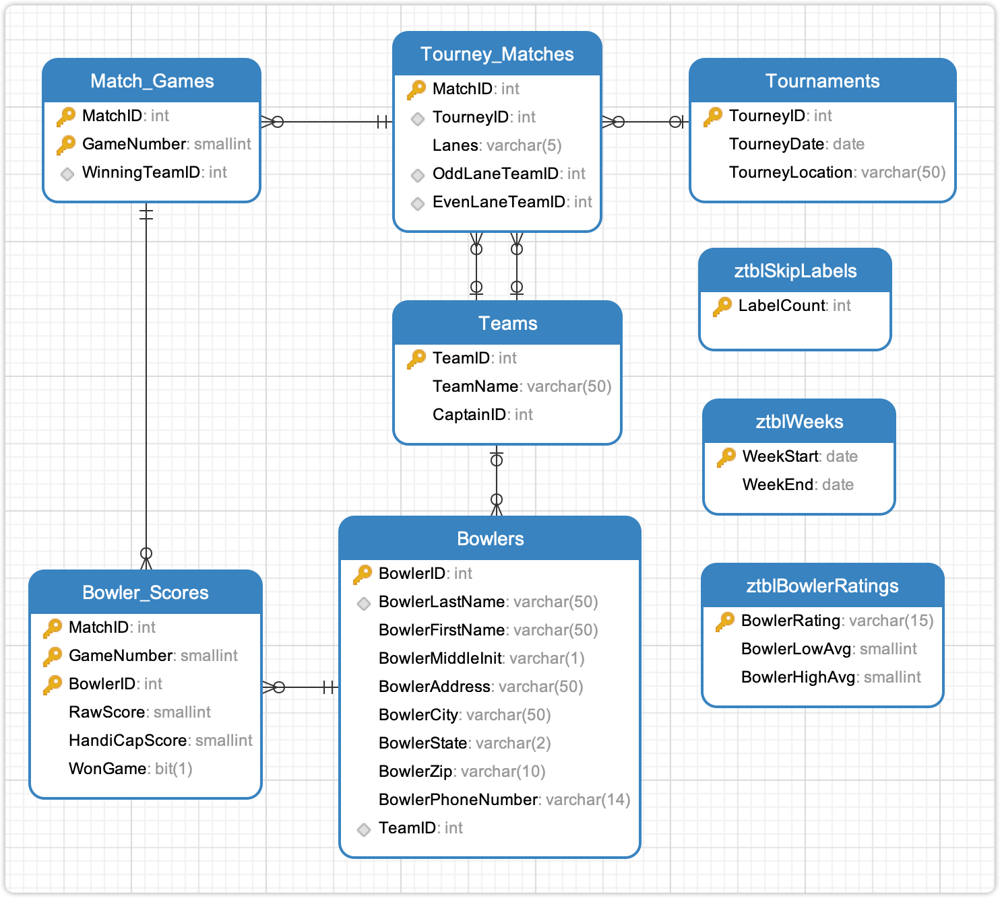

# BowlingLeagueExample

BowlingLeagueExample 是 `SQL 查询：从入门到实践（第４版）` 提供的示例数据库。

## 导入数据

使用 `shcema.SQL` 文件导入建表语句，使用 `data.SQL` 导入数据，使用 `views.SQL` 导入视图等文件，对于 `views.SQL` 创建视图文件，也可以暂时不导入。

> [!CAUTION]
> DrawSQL 疑似不支持 ADD CONSTRINAT 语句，可以删除该关键词，直接使用 Foreign Key 关键词。或者直接使用本文档同目录下 [schema-for-drawsql.sql](./schema-for-drawsql.sql) 文件。

```sh
mysql -uroot -p12345 < "schema.SQL"
mysql -uroot -p12345 < "data.SQL"
```

导入数据到 Mysql 容器中，首先需要将文件拷贝到容器中：

```sh
docker cp /path/to/schema.SQL contianer_name:/tmp/schema.SQL
docker cp /path/to/data.SQL contianer_name:/tmp/data.SQL
docker exec -it sh container_name sh
mysql -uroot -p12345 -t < /tmp/schema.SQL
mysql -uroot -p12345 -t < /tmp/data.SQL
```

## ERD 关系图




或者直接访问 [DrawSQL](https://drawsql.app/teams/sql-404/diagrams/bowlingleagueexample)，查看 ERD 关系图。

## 表字段注释

数据库包含 9 张表：

- `Bowlers` 球员表
- `Tournaments` 联赛
  - `ToryneyID` 联赛 ID
  - `ToryneyDate` 联赛日期
  - `ToryneyLocation` 联赛地点
- `Tourney_Matches` 联赛场次
  - `MatchID` 联赛场次 ID
  - `TourneyID` 联赛 ID
  - `Lanes` 保龄球道标记
  - `EvenLaneTeamID` 保龄球道 偶数球队
  - `OaddLaneTeamID` 保龄球道 奇数球队
- `Match_Games` 每场次的比赛回合
  - `MatchID` 联赛场次 ID
  - `GameNumber` 该比赛场次回合数
  - `WinningTeamID` 该比赛场次胜利团队 ID

## 练习

<details style="padding: 8px 20px; margin-bottom: 20px; background-color: rgba(142, 150, 170, 0.14);">
<summary markdown="span">#8.4.1 使用内连接，列出保龄球队及其队长的姓名</summary>

返回 10 条记录：

```sql
SELECT
Teams.TeamName,
concat(Bowlers.BowlerLastName, ', ', Bowlers.BowlerFirstName) AS CaptainName
FROM Teams
INNER JOIN Bowlers
ON Teams.CaptainID = Bowlers.BowlerID;
```

</details>

<details style="padding: 8px 20px; margin-bottom: 20px; background-color: rgba(142, 150, 170, 0.14);">

<summary markdown="span">#8.4.4 使用内连接，列出所有的保龄球联赛、场次和各局的结果 </summary>

为了列举比赛双方，需要 3 次连表 Team，获取双方的队名，及胜利队的队名。

返回 168 条记录：

```sql
SELECT
    Tournaments.TourneyID,
    Tournaments.TourneyDate,
    Tournaments.TourneyLocation,
		Tourney_Matches.MatchID,
    Tourney_Matches.Lanes,
		OddTeam.TeamName as OddTeamName,
		EvenTeam.TeamName as EvenTeamName,
    Match_Games.GameNumber,
    Match_Games.WinningTeamID,
		WinnerTeam.TeamName
FROM Tournaments
JOIN Tourney_Matches ON Tournaments.TourneyID = Tourney_Matches.TourneyID
JOIN Match_Games  ON Tourney_Matches.MatchID = Match_Games.MatchID
inner join Teams EvenTeam on Tourney_Matches.EvenLaneTeamID = EvenTeam.TeamID
inner join Teams OddTeam on Tourney_Matches.OddLaneTeamID = OddTeam.TeamID
inner join Teams WinnerTeam on Match_Games.WinningTeamID = WinnerTeam.TeamID
order by
Tournaments.TourneyDate,
Tourney_Matches.MatchID;
```

书中示例，为了获取比赛双方和赢家的队名，需要连 Team 表 3 次

返回 168 条记录：

```sql
SELECT
Tournaments.TourneyID AS Tourney,
Tournaments.TourneyLocation AS Location,
Tourney_Matches.MatchID,
Tourney_Matches.Lanes,
OddTeam.TeamName AS OddLaneTeam,
EvenTeam.TeamName AS EvenLaneTeam,
Match_Games.GameNumber AS GameNo,
Winner.TeamName AS Winner
FROM (
  (
    (
      (
        Tournaments
        INNER JOIN Tourney_Matches
        ON Tournaments.TourneyID = Tourney_Matches.TourneyID
      )
      INNER JOIN Teams AS OddTeam
      ON OddTeam.TeamID = Tourney_Matches.OddLaneTeamID
    )
    INNER JOIN Teams AS EvenTeam
    ON EvenTeam.TeamID = Tourney_Matches.EvenLaneTeamID
  )
  INNER JOIN Match_Games
  ON Match_Games.MatchID = Tourney_Matches.MatchID
)
INNER JOIN Teams AS Winner
ON Winner.TeamID = Match_Games.WinningTeamID;
```

</details>
