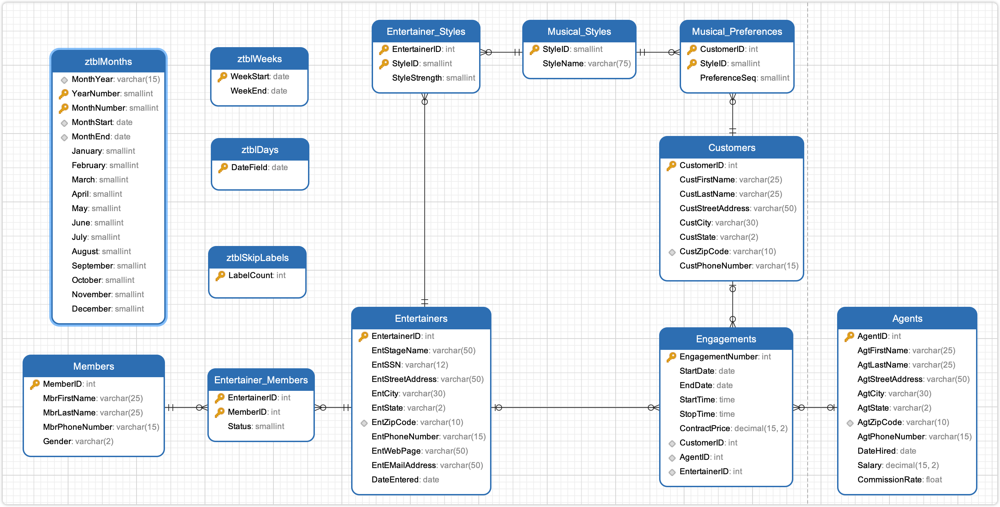

# EntertainmentAgencyExample

EntertainmentAgencyExample 是 `SQL 查询：从入门到实践（第４版）` 提供的示例数据库。

## 导入数据

使用 `schema.SQL` 文件导入建表语句，使用 `data.SQL` 导入数据。

`view.sql` 是书中提供的参考答案，以创建视图的形式保存在 SQL 文件中，可以参考，意义不大，也用不上。

> [!CAUTION]
> DrawSQL 疑似不支持 ADD CONSTRINAT 语句，可以删除该关键词，直接使用 Foreign Key 关键词。或者直接使用本文档同目录下 [schema-for-drawsql.sql](./schema-for-drawsql.sql) 文件。

```sh
mysql -uroot -p12345 < "schema.SQL"
mysql -uroot -p12345 < "data.SQL"
```

导入数据到 Mysql 容器中，首先需要将文件拷贝到容器中：

```sh
docker exec -it container_name mysql -uroot -p12345 -t < /path/to/schema.SQL
docker exec -it container_name mysql -uroot -p12345 -t < /path/to/data.SQL
```

## ERD 关系图




或者直接访问 [DrawSQL](https://drawsql.app/teams/sql-404/diagrams/entertainmentagencyexample)，查看 ERD 关系图。

## 表字段注释

数据库包含 13 张表：

- `Entertainers` 艺人（演唱组合）表。
  - `EntertainerID` 艺人的唯一标识符。
  - `EntStageName` 艺人的艺名或舞台名。
  - `EntSSN` 艺人的社会安全号码（通常在美国用作身份证明）。
  - `EntStreetAddress` 艺人的街道地址。
  - `EntCity` 艺人所在的城市。
  - `EntState` 艺人所在的州（2 个字符）。
  - `EntZipCode` 艺人的邮政编码。
  - `EntPhoneNumber` 艺人的电话号码。
  - `EntWebPage` 艺人的个人网页。
  - `EntEMailAddress` 艺人的电子邮件地址。
  - `DateEntered` 艺人进入公司的日期。
- `Engagements` 演出业务表，经纪人代表艺人和客户签订的演出业务
  - `EngagementNumber` 业务合同的唯一标识符。
  - `StartDate` 合同的开始日期。
  - `EndDate` 合同的结束日期。
  - `StartTime` 合同活动的开始时间。
  - `StopTime` 合同活动的结束时间。
  - `ContractPrice` 合同价格。
- `Agents` 经纪人
  - `AgtStreetAddress` 代理人的街道地址。
  - `AgtCity` 代理人所在的城市。
  - `AgtState` 代理人所在的州（2 个字符）。
  - `AgtZipCode` 代理人所在的邮政编码。
  - `AgtPhoneNumber` 代理人的电话号码。
  - `DateHired` 代理人被雇佣的日期。
  - `Salary` 代理人的薪资。
  - `CommissionRate` 代理人的佣金率
- `Customers`
  - `CustStreetAddress` 客户的街道地址。
  - `CustCity` 客户所在的城市。
  - `CustState` 客户所在的州（2 个字符）。
  - `CustZipCode` 客户的邮政编码。
  - `CustPhoneNumber` 客户的电话号码。
- `Entertainer_Members`
  - `EntertainerID` 艺人的唯一标识符。
  - `MemberID` 成员的唯一标识符。
  - `Status` 成员在团体中的状态（例如活跃或非活跃）
- `Entertainer_Styles`
  - `EntertainerID` 艺人的唯一标识符。
  - `StyleID` 音乐风格的唯一标识符。
  - `StyleStrength` 艺人在该风格中的擅长程度。
- `Members`
  - `MemberID` 成员的唯一标识符。
  - `MbrFirstName` 成员的名字。
  - `MbrLastName` 成员的姓氏。
  - `MbrPhoneNumber` 成员的电话号码。
  - `Gender` 成员的性别。
- `Musical_Preference`
  - `CustomerID` 客户的唯一标识符。
  - `StyleID` 音乐风格的唯一标识符。
  - `PreferenceSeq` 偏好的顺序（如客户的第一偏好，第二偏好等）。
- `Musical_Styles`
  - `StyleID` 音乐风格的唯一标识符。
  - `StyleName` 音乐风格的名称。
- `ztblDays`
  - `DateField` 日期字段，表示某一天。
- `ztblMonths` 表
  - ``MonthYear` 月份和年份的组合表示（如“August 2024”）。
  - ``YearNumber` 年份（例如 2024）。
  - ``MonthNumber` 月份数字（例如 8 表示 8 月）。
  - ``MonthStart` 月份的开始日期。
  - ``MonthEnd` 月份的结束日期。
  - ``January`到 December: 每个月的标识符，用于表示各个特定的月份。
- `ztblSkipLabels`
  - `LabelCount` 标签跳过的计数。
- `ztblWeeks`
  - ``WeekStart` 一周的开始日期。
  - ``WeekEnd` 一周的结束日期。

## 练习

<details style="padding: 8px 20px; margin-bottom: 20px; background-color: rgba(142, 150, 170, 0.14);">
<summary markdown="span">#8.4.1 使用内连接，列出演唱组合及其演出合约的开始日期、结束日期和价格</summary>

返回 111 条记录：

```sql
select EntStageName, StartDate, EndDate, ContractPrice
from Entertainers
inner join Engagements
on Entertainers.EntertainerID = Engagements.EntertainerID;
```

书中示例同上，可参考 view.sql 文件中 CH08_Entertainers_And_Contracts。

</details>

<details style="padding: 8px 20px; margin-bottom: 20px; background-color: rgba(142, 150, 170, 0.14);">
<summary markdown="span">#8.4.2 使用内连接，查找为顾客姓 Berg 或 姓 Hallmark 演出过的演唱组合</summary>

需求分析，可以将需求拆分为给顾客 Berg 演出过的演唱组合以及给顾客 Hallmark 演出过的演唱组合的并集，可以使用 Where 子句过滤笛卡尔积，只留下给 Berg 演出过的演唱组合，以及给顾客 Hallmark 演唱过的组合。

返回 8 条记录：

```sql
select distinct Entertainers.EntStageName
from Entertainers
inner join Engagements
on Entertainers.EntertainerID = Engagements.EntertainerID
inner join Customers
on Engagements.CustomerID = Customers.CustomerID
where Customers.CustLastName =  'Berg'
or Customers.CustLastName = 'Hallmark';
```

书中示例，返回 8 条记录，可参考 view.sql 文件中 CH08_Entertainers_For_Berg_OR_Hallmark：

```sql
SELECT DISTINCT Entertainers.EntStageName
FROM (
  Entertainers
  INNER JOIN Engagements
  ON Entertainers.EntertainerID = Engagements.EntertainerID
)
INNER JOIN Customers
ON Customers.CustomerID = Engagements.CustomerID
WHERE Customers.CustLastName = 'Berg'
OR Customers.CustLastName = 'Hallmark';
```

</details>

<details style="padding: 8px 20px; margin-bottom: 20px; background-color: rgba(142, 150, 170, 0.14);">
<summary markdown="span">#8.4.3 使用内连接，列出为 Berg 和 Hallmark 都演出过的演唱组合</summary>

可以将需求拆分为，为 Berg 演出过的演唱组合与为 Hallmark 演出过的演唱组合的交集。

返回 4 条记录：

```sql
select distinct A.EntStageName
from(
	(
		select Entertainers.EntertainerID, EntStageName from Entertainers
		inner join Engagements
		on Engagements.EntertainerID = Entertainers.EntertainerID
		inner join Customers
		on Customers.CustomerID = Engagements.CustomerID
		where Customers.CustLastName = "Berg"
	) as A
	inner join
	(
		select Entertainers.EntertainerID, Entertainers.EntStageName from Entertainers
		inner join Engagements
		on Engagements.EntertainerID = Entertainers.EntertainerID
		inner join Customers
		on Customers.CustomerID = Engagements.CustomerID
		where Customers.CustLastName = "Hallmark"
	) as B
	on A.EntertainerID = B.EntertainerID
);
```

书中示例，返回 4 条记录，可参考 view.sql 文件中 CH08_Entertainers_Berg_AND_Hallmark：

```sql
SELECT EntBerg.EntStageName
    FROM
       (SELECT DISTINCT Entertainers.EntertainerID,
          Entertainers.EntStageName
        FROM (Entertainers
        INNER JOIN Engagements
          ON Entertainers.EntertainerID =
             Engagements.EntertainerID)
        INNER JOIN Customers
          ON Customers.CustomerID =
             Engagements.CustomerID
        WHERE Customers.CustLastName = 'Berg')
    AS EntBerg INNER JOIN
      (SELECT DISTINCT Entertainers.EntertainerID,
          Entertainers.EntStageName
       FROM (Entertainers
       INNER JOIN Engagements
         ON Entertainers.EntertainerID =
            Engagements.EntertainerID)
       INNER JOIN Customers
         ON Customers.CustomerID =
            Engagements.CustomerID
       WHERE Customers.CustLastName = 'Hallmark')
      AS EntHallmark
    ON EntBerg.EntertainerID =
        EntHallmark.EntertainerID
```

</details>

<details style="padding: 8px 20px; margin-bottom: 20px; background-color: rgba(142, 150, 170, 0.14);">
<summary markdown="span">#8.6 使用内连接，显示经纪人及其签订的演出合约的日期，并按演出合约的起始日期排序</summary>

需求分析，由于并没有说要列出没有任何合约的经纪人，所以使用内连接即可以获得。

返回 111 条记录：

```sql
select Agents.AgtFirstName, Agents.AgtLastName, Engagements.StartDate, Engagements.StartTime
from Agents
inner join Engagements
on Agents.AgentID = Engagements.AgentID
order by Engagements.StartDate, Engagements.StartTime;
```

书中示例同上，可参考 view.sql 文件中的 CH08_Agents_Booked_Dates

</details>
<details style="padding: 8px 20px; margin-bottom: 20px; background-color: rgba(142, 150, 170, 0.14);">
<summary markdown="span">#8.6 使用内连接，列出顾客及其签约过的演唱组合</summary>

返回 75 条记录：

```sql
select
distinct Customers.CustomerID,
Customers.CustFirstName,
Customers.CustLastName,
Entertainers.EntertainerID
from Customers
inner join Engagements
on Customers.CustomerID = Engagements.CustomerID
inner join Entertainers
on Engagements.EntertainerID = Entertainers.EntertainerID;
```

书中示例返回 75 条记录，可参考 view.sql 文件中的 CH08_Customers_Booked_Entertainers

```sql
SELECT DISTINCT Concat(Customers.CustFirstName, ' ', Customers.CustLastName) AS CustFullName, Entertainers.EntStageName
FROM (Customers
INNER JOIN Engagements
ON Customers.CustomerID = Engagements.CustomerID)
INNER JOIN Entertainers
ON Entertainers.EntertainerID = Engagements.EntertainerID;
```

</details>
<details style="padding: 8px 20px; margin-bottom: 20px; background-color: rgba(142, 150, 170, 0.14);">
<summary markdown="span">#8.6 使用内连接，找出居住地邮政编码相同的经纪人和演唱组合</summary>

返回 10 条记录：

```sql
select
distinct
Entertainers.EntStageName,
Entertainers.EntZipCode,
Agents.AgtFirstName,
Agents.AgtLastName,
Agents.AgtZipCode
from Entertainers
inner JOIN Agents
on Entertainers.EntZipCode = Agents.AgtZipCode;
```

书中示例同上，可参考 view.sql 文件中的 CH08_Agents_Entertainers_Same_Postal

</details>
<details style="padding: 8px 20px; margin-bottom: 20px; background-color: rgba(142, 150, 170, 0.14);">
<summary markdown="span">#9.5 使用外连接，列出从未签约的组合</summary>

返回 1 条记录：

```sql
select Entertainers.EntertainerID,Entertainers.EntStageName
from Entertainers
left join Engagements
on Entertainers.EntertainerID = Engagements.EntertainerID
where Engagements.EntertainerID is NULL;
```

书中示例同上，可参考 view.sql 文件中 CH09_Entertainers_Never_Booked。

</details>
<details style="padding: 8px 20px; margin-bottom: 20px; background-color: rgba(142, 150, 170, 0.14);">
<summary markdown="span">#9.5 使用外连接，列出所有的音乐风格以及喜欢各种风格的顾客</summary>

left join 只有在 1 对多，1 对多的情况下，才不会出现意外情况。而本需求可以查看 DrawSQL 的 ERD 图可以看出，Musical_Styles 与 Musical_Preferences 是 1 对多，而 Musical_Preferences 和 Customers 是多对 1，不适合连续 left join，也就是不适用 `Musical_Styles left join Musical_Preferences left join Customers` 的情况。

但由于 Customer 和 Musical_Preferences 是 1 对多的情况，这两者表适合内连接，所以先将这两张表连接，作为新的结果集，然后 Musical_Styles 就可以和这个结果集进行左连接了。

返回 41 条记录：

```sql
select
Musical_Styles.StyleID, Musical_Styles.StyleName,
Customers.CustomerID, Customers.CustFirstName, Customers.CustLastName
from Musical_Styles
left join (
	Musical_Preferences
	INNER JOIN Customers
	on Musical_Preferences.CustomerID = Customers.CustomerID
)
on Musical_Preferences.StyleID = Musical_Styles.StyleID;
```

书中示例同上左连接示例，可参考 view.sql 文件中 CH09_All_Styles_And_Any_Customers。

知晓逻辑后就可以使用右外连接来改写上述 SQL，返回 41 条记录：

```sql
select Musical_Styles.StyleID, Musical_Styles.StyleName,
Customers.CustomerID, Customers.CustFirstName, CustLastName
from Customers
inner join Musical_Preferences
on Customers.CustomerID = Musical_Preferences.CustomerID
right join Musical_Styles
on Musical_Styles.StyleID = Musical_Preferences.StyleID
```

</details>

<details style="padding: 8px 20px; margin-bottom: 20px; background-color: rgba(142, 150, 170, 0.14);">
<summary markdown="span">#9.7 使用外连接，显示没有签订任何演出合约的经纪人</summary>

返回 1 条记录：

```sql
select Agents.AgentID, Agents.AgtFirstName, Agents.AgtLastName
from Agents
left join Engagements
on Engagements.AgentID = Agents.AgentID
where Engagements.AgentID is NULL;
```

书中示例同上，可参考 view.sql 文件中的 CH09_Agents_No_Contracts

</details>
<details style="padding: 8px 20px; margin-bottom: 20px; background-color: rgba(142, 150, 170, 0.14);">
<summary markdown="span">#9.7 使用外连接，列出没有与任何演唱组合签约的顾客</summary>

返回 2 条记录：

```sql
select Customers.CustomerID, Customers.CustFirstName, Customers.CustLastName
from Customers
left join Engagements
on Customers.CustomerID = Engagements.CustomerID
where Engagements.CustomerID is NULL;
```

书中示例同上，可参考 view.sql 文件中的 CH09_Customers_No_Bookings

</details>
<details style="padding: 8px 20px; margin-bottom: 20px; background-color: rgba(142, 150, 170, 0.14);">
<summary markdown="span">#9.7 使用外连接，列出所有的演唱组合及其签订的演出合约</summary>

返回 2 条记录：

```sql
select Entertainers.EntStageName, Engagements.StartDate, EngagementNumber, Engagements.CustomerID
from Entertainers
left JOIN Engagements
on Entertainers.EntertainerID = Engagements.EntertainerID;
```

书中示例同上，可参考 view.sql 文件中的 CH09_All_Entertainers_And_Any_Engagements

</details>

<details style="padding: 8px 20px; margin-bottom: 20px; background-color: rgba(142, 150, 170, 0.14);">
<summary markdown="span">#10.4 使用 union，生成一个包含经纪人和演唱组合的清单</summary>

书中示例，返回 22 条记录，可参考 view.sql 文件中 CH10_Agents_UNION_Entertainers：

```sql
SELECT
concat(Agents.AgtLastName, ', ', Agents.AgtFirstName) AS NAME,
'Agent' AS Type
FROM Agents
UNION
SELECT
	Entertainers.EntStageName,
	'Entertainer' AS Type
FROM Entertainers
```

</details>

<details style="padding: 8px 20px; margin-bottom: 20px; background-color: rgba(142, 150, 170, 0.14);">
<summary markdown="span">#11.5.1 列表达式中使用标量子查询，显示所有的顾客及其签订的最后一个演出合约的演出日期</summary>

书中示例，返回 15 条记录，可参考 view.sql 文件中 CH11_Customers_Last_Booking：

```sql
SELECT
	Customers.CustFirstName,
	Customers.CustLastName,
	( SELECT MAX( StartDate ) FROM Engagements
		WHERE Engagements.CustomerID = Customers.CustomerID
	)
	AS LastBooking
FROM Customers;
```

</details>

<details style="padding: 8px 20px; margin-bottom: 20px; background-color: rgba(142, 150, 170, 0.14);">
<summary markdown="span">#11.5.2 筛选器中使用子查询，列出给顾客 Berg 演出过的演唱组合</summary>

书中示例，返回 6 条记录，可参考 view.sql 文件中 CH11_Entertainers_Berg_EXISTS：

```sql
SELECT EntertainerID, EntStageName
FROM Entertainers
WHERE EXISTS (
	SELECT * FROM Customers
	INNER JOIN Engagements
	ON Customers.CustomerID = Engagements.CustomerID
	WHERE Customers.CustLastName = 'Berg'
	AND Engagements.EntertainerID = Entertainers.EntertainerID
)
```

</details>

<details style="padding: 8px 20px; margin-bottom: 20px; background-color: rgba(142, 150, 170, 0.14);">
<summary markdown="span">#11.7 使用子查询 TODO，列出所有的演唱组合及其签订的演出合约数量</summary>

提示: 使用聚合函数 COUNT

书中示例，返回 13 条记录，可参考 view.sql 文件中 CH11_Entertainer_Engagement_Count:

```sql
SELECT
	Entertainers.EntStageName,
	(
		SELECT COUNT(*)
		FROM Engagements
		WHERE Engagements.EntertainerID = Entertainers.EntertainerID
	) AS EngageCount
FROM Entertainers;
```

</details>
<details style="padding: 8px 20px; margin-bottom: 20px; background-color: rgba(142, 150, 170, 0.14);">
<summary markdown="span">#11.7 使用子查询 TODO，列出与演奏乡村音乐或乡村摇滚的演唱组合签约过的顾客</summary>

提示: 使用 IN 创建一个筛选器

书中示例，返回 13 条记录，可参考 view.sql 文件中 CH11_Customers_Who_Like_Country:

```sql
SELECT CustomerID, CustFirstName, CustLastName
FROM Customers
WHERE Customers.CustomerID IN (
	SELECT Engagements.CustomerID
	FROM (
		(
			Musical_Styles
			INNER JOIN Entertainer_Styles ON Musical_Styles.StyleID = Entertainer_Styles.StyleID
		)
		INNER JOIN Entertainers ON Entertainers.EntertainerID = Entertainer_Styles.EntertainerID
	)
	INNER JOIN Engagements ON Entertainers.EntertainerID = Engagements.EntertainerID
	WHERE Musical_Styles.StyleName = 'Country'
	OR Musical_Styles.StyleName = 'Country Rock'
);
```

</details>
<details style="padding: 8px 20px; margin-bottom: 20px; background-color: rgba(142, 150, 170, 0.14);">
<summary markdown="span">#11.7 使用子查询 TODO，找出给顾客 Berg 或 Hallmark 演出过的演唱组合</summary>

提示: 使用= SOME 创建一个筛选器

书中示例，返回 8 条记录，可参考 view.sql 文件中 CH11_Entertainers_Berg_OR_Hallmark_SOME:

```sql
SELECT EntertainerID, EntStageName
FROM Entertainers
WHERE Entertainers.EntertainerID = SOME (
	SELECT Engagements.EntertainerID
	FROM Customers
	INNER JOIN Engagements
	ON Customers.CustomerID = Engagements.CustomerID
	WHERE Customers.CustLastName = 'Berg'
	OR Customers.CustLastName = 'Hallmark'
);
```

</details>
<details style="padding: 8px 20px; margin-bottom: 20px; background-color: rgba(142, 150, 170, 0.14);">
<summary markdown="span">#11.7 使用子查询 TODO，显示没有签订任何演出合约的经纪人</summary>

提示: 使用 NOT IN 创建一个筛选器

书中示例，返回 1 条记录，可参考 view.sql 文件中 CH11_Bad_Agents:

```sql
SELECT AgentID, AgtFirstName, AgtLastName
FROM Agents
WHERE Agents.AgentID NOT IN (
	SELECT Engagements.AgentID
	FROM Engagements
);
```

</details>
