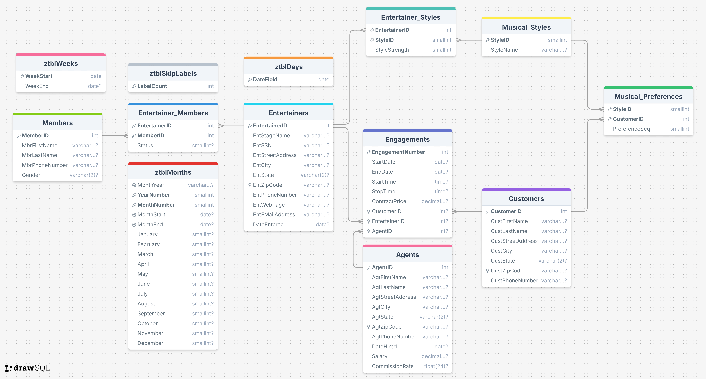

# EntertainmentAgencyExample

EntertainmentAgencyExample 是 `SQL 查询：从入门到实践（第４版）` 提供的示例数据库。

## 导入数据

使用 `schema.SQL` 文件导入建表语句，使用 `data.SQL` 导入数据，使用 `views.SQL` 导入视图等文件，对于 `views.SQL` 创建视图文件，也可以暂时不导入。

> [!CAUTION]
> DrawSQL 疑似不支持 ADD CONSTRINAT 语句，可以删除该关键词，直接使用 Foreign Key 关键词。或者直接使用本文档同目录下 [schema-for-drawsql.sql](./schema-for-drawsql.sql) 文件。

```sh
mysql -uroot -p12345 < "schema.SQL"
mysql -uroot -p12345 < "data.SQL"
```

导入数据到 Mysql 容器中，首先需要将文件拷贝到容器中：

```sh
docker exec -it container_name mysql -uroot -p12345 -t < /path/to/schema.SQL
docker exec -it container_name mysql -uroot -p12345 -t < /path/to/data.SQL
```

## ERD 关系图




或者直接访问 [DrawSQL](https://drawsql.app/teams/sql-404/diagrams/entertainmentagencyexample)，查看 ERD 关系图。

## 表字段注释

数据库包含 13 张表：

- `Entertainers` 艺人（演唱组合）表
  - `EntStageName` 艺人（演唱组合）名称

## 练习

<details style="padding: 8px 20px; margin-bottom: 20px; background-color: rgba(142, 150, 170, 0.14);">
<summary markdown="span">#8.4.1 使用内连接，列出演唱组合及其演出合约的开始日期、结束日期和价格</summary>

返回 111 条记录：

```sql
select EntStageName, StartDate, EndDate, ContractPrice
from Entertainers
inner join Engagements
on Entertainers.EntertainerID = Engagements.EntertainerID;
```

</details>

<details style="padding: 8px 20px; margin-bottom: 20px; background-color: rgba(142, 150, 170, 0.14);">
<summary markdown="span">#8.4.2 使用内连接，查找为顾客姓 Berg 或 姓 Hallmark 演出过的演唱组合</summary>

返回 8 条记录：

```sql
select distinct Entertainers.EntStageName from Entertainers
inner join Engagements
on Entertainers.EntertainerID = Engagements.EntertainerID
inner join Customers
on Engagements.CustomerID = Customers.CustomerID
where Customers.CustLastName =  'Berg'
or Customers.CustLastName = 'Hallmark';
```

书中示例，返回 8 条记录：

```sql
SELECT DISTINCT Entertainers.EntStageName
FROM (
  Entertainers
  INNER JOIN Engagements
  ON Entertainers.EntertainerID = Engagements.EntertainerID
)
INNER JOIN Customers
ON Customers.CustomerID = Engagements.CustomerID
WHERE Customers.CustLastName = 'Berg'
OR Customers.CustLastName = 'Hallmark';
```

</details>

<details style="padding: 8px 20px; margin-bottom: 20px; background-color: rgba(142, 150, 170, 0.14);">
<summary markdown="span">#8.4.3 使用内连接，列出为 Berg 和 Hallmark 都演出过的演唱组合</summary>

可以将需求拆分为，为 Berg 演出过的演唱组合与为 Hallmark 演出过的演唱组合的交集。

返回 4 条记录：

```sql
select distinct A.EntStageName
from(
	(
		select Entertainers.EntertainerID, EntStageName from Entertainers
		inner join Engagements
		on Engagements.EntertainerID = Entertainers.EntertainerID
		inner join Customers
		on Customers.CustomerID = Engagements.CustomerID
		where Customers.CustLastName = "Berg"
	) as A
	inner join
	(
		select Entertainers.EntertainerID, Entertainers.EntStageName from Entertainers
		inner join Engagements
		on Engagements.EntertainerID = Entertainers.EntertainerID
		inner join Customers
		on Customers.CustomerID = Engagements.CustomerID
		where Customers.CustLastName = "Hallmark"
	) as B
	on A.EntertainerID = B.EntertainerID
);
```

书中示例，返回 4 条记录：

```sql
SELECT EntBerg.EntStageName
    FROM
       (SELECT DISTINCT Entertainers.EntertainerID,
          Entertainers.EntStageName
        FROM (Entertainers
        INNER JOIN Engagements
          ON Entertainers.EntertainerID =
             Engagements.EntertainerID)
        INNER JOIN Customers
          ON Customers.CustomerID =
             Engagements.CustomerID
        WHERE Customers.CustLastName = 'Berg')
    AS EntBerg INNER JOIN
      (SELECT DISTINCT Entertainers.EntertainerID,
          Entertainers.EntStageName
       FROM (Entertainers
       INNER JOIN Engagements
         ON Entertainers.EntertainerID =
            Engagements.EntertainerID)
       INNER JOIN Customers
         ON Customers.CustomerID =
            Engagements.CustomerID
       WHERE Customers.CustLastName = 'Hallmark')
      AS EntHallmark
    ON EntBerg.EntertainerID =
        EntHallmark.EntertainerID
```

</details>

<details style="padding: 8px 20px; margin-bottom: 20px; background-color: rgba(142, 150, 170, 0.14);">
<summary markdown="span">#8.6 使用内连接，显示经纪人及其签订的演出合约的日期，并按演出合约的起始日期排序</summary>

返回 111 条记录：

```sql
select Agents.AgtFirstName, Agents.AgtLastName, Engagements.StartDate, Engagements.StartTime
from Agents
inner join Engagements
on Agents.AgentID = Engagements.AgentID
order by Engagements.StartDate, Engagements.StartTime;
```

</details>
<details style="padding: 8px 20px; margin-bottom: 20px; background-color: rgba(142, 150, 170, 0.14);">
<summary markdown="span">#8.6 使用内连接，列出顾客及其签约过的演唱组合</summary>

返回 75 条记录：

```sql
select
distinct Customers.CustomerID,
Customers.CustFirstName,
Customers.CustLastName,
Entertainers.EntertainerID
from Customers
inner join Engagements
on Customers.CustomerID = Engagements.CustomerID
inner join Entertainers
on Engagements.EntertainerID = Entertainers.EntertainerID;
```

</details>
<details style="padding: 8px 20px; margin-bottom: 20px; background-color: rgba(142, 150, 170, 0.14);">
<summary markdown="span">#8.6 使用内连接，找出居住地邮政编码相同的经纪人和演唱组合</summary>

返回 10 条记录：

```sql
select
distinct
Entertainers.EntStageName,
Entertainers.EntZipCode,
Agents.AgtFirstName,
Agents.AgtLastName,
Agents.AgtZipCode
from Entertainers
inner JOIN Agents
on Entertainers.EntZipCode = Agents.AgtZipCode;
```

</details>
<details style="padding: 8px 20px; margin-bottom: 20px; background-color: rgba(142, 150, 170, 0.14);">
<summary markdown="span">#9.5 使用外连接，列出从未签约的组合</summary>

返回 1 条记录：

```sql
select Entertainers.EntertainerID,Entertainers.EntStageName
from Entertainers
left join Engagements
on Entertainers.EntertainerID = Engagements.EntertainerID
where Engagements.EntertainerID is NULL;
```

</details>
<details style="padding: 8px 20px; margin-bottom: 20px; background-color: rgba(142, 150, 170, 0.14);">
<summary markdown="span">#9.5 使用外连接，列出所有的音乐风格以及喜欢各种风格的顾客</summary>

left join 只有在 1 对多，1 对多的情况下，才不会出现意外情况。而本需求可以查看 DrawSQL 的 ERD 图可以看出，Musical_Styles 与 Musical_Preferences 是 1 对多，而 Musical_Preferences 和 Customers 是多对 1，不适合连续 left join，也就是不适用 `Musical_Styles left join Musical_Preferences left join Customers` 的情况。

但由于 Customer 和 Musical_Preferences 是 1 对多的情况，这两者表适合内连接，所以先将这两张表连接，作为新的结果集，然后 Musical_Styles 就可以和这个结果集进行左连接了。

返回 41 条记录：

```sql
select
Musical_Styles.StyleID, Musical_Styles.StyleName,
Customers.CustomerID, Customers.CustFirstName, Customers.CustLastName
from Musical_Styles
left join (
	Musical_Preferences
	INNER JOIN Customers
	on Musical_Preferences.CustomerID = Customers.CustomerID
)
on Musical_Preferences.StyleID = Musical_Styles.StyleID;
```

知晓逻辑后就可以使用右外连接来改写上述 SQL，返回 41 条记录：

```sql
select Musical_Styles.StyleID, Musical_Styles.StyleName,
Customers.CustomerID, Customers.CustFirstName, CustLastName
from Customers
inner join Musical_Preferences
on Customers.CustomerID = Musical_Preferences.CustomerID
right join Musical_Styles
on Musical_Styles.StyleID = Musical_Preferences.StyleID
```

</details>

<details style="padding: 8px 20px; margin-bottom: 20px; background-color: rgba(142, 150, 170, 0.14);">
<summary markdown="span">#9.7 使用外连接，显示没有签订任何演出合约的经纪人</summary>

返回 1 条记录：

```sql
select Agents.AgentID, Agents.AgtFirstName, Agents.AgtLastName
from Agents
left join Engagements
on Engagements.AgentID = Agents.AgentID
where Engagements.AgentID is NULL;
```

</details>
<details style="padding: 8px 20px; margin-bottom: 20px; background-color: rgba(142, 150, 170, 0.14);">
<summary markdown="span">#9.7 使用外连接，列出没有与任何演唱组合签约的顾客</summary>

返回 2 条记录：

```sql
select Customers.CustomerID, Customers.CustFirstName, Customers.CustLastName
from Customers
left join Engagements
on Customers.CustomerID = Engagements.CustomerID
where Engagements.CustomerID is NULL;
```

</details>
<details style="padding: 8px 20px; margin-bottom: 20px; background-color: rgba(142, 150, 170, 0.14);">
<summary markdown="span">#9.7 使用外连接，列出所有的演唱组合及其签订的演出合约</summary>

返回 2 条记录：

```sql
select Entertainers.EntStageName, Engagements.StartDate, EngagementNumber, Engagements.CustomerID
from Entertainers
left JOIN Engagements
on Entertainers.EntertainerID = Engagements.EntertainerID;
```

</details>
