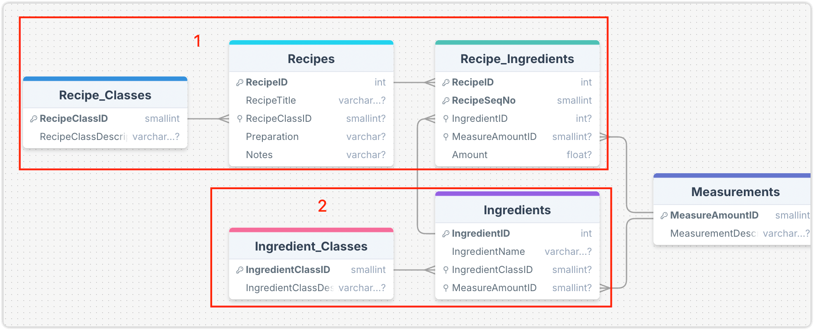

# RecipesExample

RecipesExample 是 `SQL 查询：从入门到实践（第４版）` 提供的示例数据库。

## 导入数据

使用 `schema.SQL` 文件导入建表语句，使用 `data.SQL` 导入数据。

`view.sql` 是书中提供的参考答案，以创建视图的形式保存在 SQL 文件中，可以参考，意义不大，也用不上。

> [!CAUTION]
> DrawSQL 疑似不支持 ADD CONSTRINAT 语句，可以删除该关键词，直接使用 Foreign Key 关键词。或者直接使用本文档同目录下 [schema-for-drawsql.sql](./schema-for-drawsql.sql) 文件。

```sh
mysql -uroot -p12345 < "schema.SQL"
mysql -uroot -p12345 < "data.SQL"
```

导入数据到 Mysql 容器中，首先需要将文件拷贝到容器中：

```sh
docker exec -it container_name mysql -uroot -p12345 -t < /path/to/schema.SQL
docker exec -it container_name mysql -uroot -p12345 -t < /path/to/data.SQL
```

## ERD 关系图


或者直接访问 [DrawSQL](https://drawsql.app/teams/sql-404/diagrams/recipesexample)，查看 ERD 关系图。

## 表字段注释

数据库包含 6 张表：

- `Recipes` 菜品表
  - `RecipeID` 菜品 ID
  - `RecipeTitle` 菜品名称
  - `RecipeClassID` 菜品分类 ID
  - `Preparation` 菜品制作方法
  - `Notes` 菜品提示
- `Recipe_Classes` 菜品分类表
  - `RecipeClassID` 菜品分类 ID
  - `RecipeClassDescription` 菜品分类名称
- `Ingredients` 食材表（成分）
  - `IngredientID` 食材 ID
  - `IngredientName` 食材名称
  - `IngredientClassID` 食材分类
  - `MeasureAmountID` 计量单位 ID
- `Ingredient_Classes` 食材分类表
  - `IngredientClassID` 食材分类 ID
  - `IngredientClassDescription` 成分分类名称
- `Recipe_Ingredients` 菜品-食材 linking table
  - `RecipeID` 菜品 ID
  - `IngredientID` 食材 ID
  - `RecipeSeqNo` 食材顺序
  - `MeasureAmountID` 计量单位 ID
  - `Amount` 食材用量用量
- `Measurements` 计量单位表
  - `MeasureID` 计量单位 ID
  - `MeasurementDescription` 计量单位名称

## 练习

<details style="padding: 8px 20px; margin-bottom: 20px; background-color: rgba(142, 150, 170, 0.14);">
<summary markdown="span">#8.2.3-2 使用内连接，列出数据库中所有菜品的名称，制作方法和菜品类型描述</summary>

返回 15 条记录

```sql
select RecipeTitle, RecipeClassDescription, Preparation
from Recipes
inner join Recipe_Classes
on Recipe_Classes.RecipeClassID = Recipes.RecipeClassID;
```

书中示例，返回 15 条记录：

```sql
select RecipeTitle, RecipeClassDescription, Preparation
from Recipes, Recipe_Classes
where Recipe_Classes.RecipeClassID = Recipes.RecipeClassID;
```

由于是 `所有菜品`，所以正确 SQL 应该是使用 left join，但本题出现在内连接章节中，且不论是内连接，还是左外连接，由于不存在没有菜品分类的菜品，所以结果是一样。

</details>
<details style="padding: 8px 20px; margin-bottom: 20px; background-color: rgba(142, 150, 170, 0.14);">
<summary markdown="span">#8.2.3-2 使用内连接，列出数据库中菜品分类为主菜 Main course 或者甜品 Dessert 的菜品的名称，制作方法和菜品类型描述</summary>

需求分析，Recipes 共有 15 条记录，Recipe_Classes 共有 7 条件，也就是造成了 7 x 15 = 105 条查询记录

返回 9 条记录：

```sql
select RecipeTitle, RecipeClassDescription, Preparation
from Recipes
inner join Recipe_Classes
on Recipe_Classes.RecipeClassID = Recipes.RecipeClassID
where RecipeClassDescription = "Main course"
or RecipeClassDescription = "Dessert";
```

</details>

<details style="padding: 8px 20px; margin-bottom: 20px; background-color: rgba(142, 150, 170, 0.14);">
<summary markdown="span">#8.2.3-3 使用内连接，使用子查询优化上述查询</summary>

使用子查询优化后，子查询的派生表 Derived Table 只有 2 条数据，内连接表 Recipes 有 7 条数据，于是就有了 7 x 2 = 14 条查询记录。

虽然理论上降低了参与查询的数据量，优化了查询速度，但实际上 Mysql 优化器会进行主动优化。通过 Explain 分析查询语句，发现两种查询语句的效率其实是一样的。

返回 9 条记录：

```sql
select RecipeTitle, Preparation, DerivedTable.RecipeClassDescription
from (
  select RecipeClassID, RecipeClassDescription
  from Recipe_Classes
  where RecipeClassDescription = "Main course"
  or RecipeClassDescription = "Dessert"
) as DerivedTable -- [!code ++] 子查询派生表需要添加别名 alias
inner join Recipes
on DerivedTable.RecipeClassID = Recipes.RecipeClassID;
```

</details>

<details style="padding: 8px 20px; margin-bottom: 20px; background-color: rgba(142, 150, 170, 0.14);">

<summary markdown="span">#8.2.3-4 使用内连接，五表连接，获取菜品类型、菜品名、制作说明、食材名、食材序号、食材数量和食材度 量单位，并按菜品名和序号排序</summary>


如果不存在外键缺失为 NULL 的情况，可以不使用左外连接来获取结果集，因为不存在外键为 NULL 的情况。但如果存在外键为 NULL 的情况，就必须使用 left join 来获取这些数据，因为可能存在没有分类的菜品，没有食材的菜品等情况。

返回 88 条记录：

```sql
select Recipe_Classes.RecipeClassDescription,
	Recipes.RecipeTitle,
	Ingredients.IngredientName,
	Recipe_Ingredients.RecipeSeqNo,
	Recipe_Ingredients.Amount,
	Measurements.MeasurementDescription,
	Recipes.Preparation
from Recipes
inner JOIN Recipe_Classes on Recipes.RecipeClassID = Recipe_Classes.RecipeClassID
inner JOIN Recipe_Ingredients on Recipes.RecipeID = Recipe_Ingredients.RecipeID
inner JOIN Ingredients on Recipe_Ingredients.IngredientID = Ingredients.IngredientID
inner join Measurements on Recipe_Ingredients.MeasureAmountID = Measurements.MeasureAmountID
order by
Recipes.RecipeTitle,
RecipeSeqNo;
Recipes.RecipeTitle;
```

书中示例 1，返回 88 条记录：

```sql
SELECT
Recipe_Classes.RecipeClassDescription,
Recipes.RecipeTitle,
Recipes.Preparation,
Ingredients.IngredientName,
Recipe_Ingredients.RecipeSeqNo,
Recipe_Ingredients.Amount,
Measurements.MeasurementDescription
FROM (
  (
    (
      Recipe_Classes
      INNER JOIN Recipes
      ON Recipe_Classes.RecipeClassID =
      Recipes.RecipeClassID
    )
    INNER JOIN Recipe_Ingredients
    ON Recipes.RecipeID =
    Recipe_Ingredients.RecipeID
  )
  INNER JOIN Ingredients
  ON Ingredients.IngredientID =
     Recipe_Ingredients.IngredientID
)
INNER JOIN Measurements
ON Measurements.MeasureAmountID = Recipe_Ingredients.MeasureAmountID
ORDER BY RecipeTitle, RecipeSeqNo
```

书中示例 2，返回 88 条记录：

```sql
SELECT
Recipe_Classes.RecipeClassDescription,
Recipes.RecipeTitle,
Recipes.Preparation,
Ingredients.IngredientName,
Recipe_Ingredients.RecipeSeqNo,
Recipe_Ingredients.Amount,
Measurements.MeasurementDescription
FROM Recipe_Classes
INNER JOIN (
  (
    (
      Recipes
      INNER JOIN Recipe_Ingredients
      ON Recipes.RecipeID = Recipe_Ingredients.RecipeID
    )
    INNER JOIN Ingredients
    ON Ingredients.IngredientID = Recipe_Ingredients.IngredientID
  )
  INNER JOIN Measurements
  ON Measurements.MeasureAmountID = Recipe_Ingredients.MeasureAmountID
)
ON Recipe_Classes.RecipeClassID = Recipes.RecipeClassID
ORDER BY RecipeTitle, RecipeSeqNo
```

</details>

<details style="padding: 8px 20px; margin-bottom: 20px; background-color: rgba(142, 150, 170, 0.14);">
<summary markdown="span">#8.2.4 使用内连接，列出所有菜品的名称以及制作每种菜品所需的食材</summary>

需求分析，返回 `所有` 菜品的名称，如果确保数据库不存在外键缺失的情况，可以使用内连接，如果可能存在外键缺失的情况，也就是外键为 NULL 导致内连接匹配后丢失该行数据，则需要使用外连接。

返回 88 条记录：

```sql
select RecipeTitle, IngredientName
from Recipes
INNER JOIN Recipe_Ingredients
on Recipes.RecipeID = Recipe_Ingredients.RecipeID
inner join Ingredients
on Recipe_Ingredients.IngredientID = Ingredients.IngredientID;
```

书中示例，返回 88 条记录：

```sql
SELECT
Recipes.RecipeTitle,
Ingredients.IngredientName
FROM (
  Recipes
  INNER JOIN Recipe_Ingredients
  ON Recipes.RecipeID = Recipe_Ingredients.RecipeID
)
INNER JOIN Ingredients
ON Ingredients.IngredientID = Recipe_Ingredients.IngredientID;
```

</details>

<details style="padding: 8px 20px; margin-bottom: 20px; background-color: rgba(142, 150, 170, 0.14);">
<summary markdown="span">#8.4.1 使用内连接，列出包含食材牛肉或大蒜的菜品</summary>

返回 5 条记录：

```sql
select DISTINCT Recipes.RecipeTitle
from Recipes
inner join Recipe_Ingredients
on Recipes.RecipeID = Recipe_Ingredients.RecipeID
inner join Ingredients
on Recipe_Ingredients.IngredientID = Ingredients.IngredientID
where Ingredients.IngredientName = 'Beef' or Ingredients.IngredientName = 'Garlic';
```

优化一下：

```sql
select DISTINCT Recipes.RecipeTitle
from Recipes
inner join Recipe_Ingredients
on Recipes.RecipeID = Recipe_Ingredients.RecipeID
where Recipe_Ingredients.IngredientID in (
  select distinct IngredientID from Ingredients
  where Ingredients.IngredientName = 'Beef' or Ingredients.IngredientName = 'Garlic'
);
```

书中示例，返回 5 条记录，可参考 view.sql 文件中的 CH08_Beef_Or_Garlic_Recipes：

```sql
SELECT DISTINCT Recipes.RecipeTitle
FROM Recipes
INNER JOIN Recipe_Ingredients
ON Recipes.RecipeID = Recipe_Ingredients.RecipeID
WHERE Recipe_Ingredients.IngredientID IN (1, 9);
```

</details>
<details style="padding: 8px 20px; margin-bottom: 20px; background-color: rgba(142, 150, 170, 0.14);">
<summary markdown="span">#8.4.2 使用内连接，列出主菜及其使用的所有食材</summary>

返回 53 条记录：

```sql
select RecipeTitle, IngredientName, MeasurementDescription, Amount
from Recipes
inner join Recipe_Classes
on Recipe_Classes.RecipeClassID = Recipes.RecipeClassID
inner join Recipe_Ingredients
on Recipes.RecipeID = Recipe_Ingredients.RecipeID
inner join Ingredients
on Recipe_Ingredients.IngredientID = Ingredients.IngredientID
inner join Measurements
on Recipe_Ingredients.MeasureAmountID = Measurements.MeasureAmountID
where Recipe_Classes.RecipeClassDescription = 'Main Course';
```

书中示例，返回 53 条记录，可参考 view.sql 文件中 CH08_Main_Course_Ingredients：

```sql
SELECT Recipes.RecipeTitle,Ingredients.IngredientName,
Measurements.MeasurementDescription,Recipe_Ingredients.Amount
FROM (
  (
    (
      Recipe_Classes
      INNER JOIN Recipes
      ON Recipes.RecipeClassID = Recipe_Classes.RecipeClassID
    )
    INNER JOIN Recipe_Ingredients
    ON Recipes.RecipeID = Recipe_Ingredients.RecipeID
  )
  INNER JOIN Ingredients
  ON Ingredients.IngredientID = Recipe_Ingredients.IngredientID
)
INNER JOIN Measurements
ON Measurements.MeasureAmountID = Recipe_Ingredients.MeasureAmountID
WHERE Recipe_Classes.RecipeClassDescription = 'Main course';
```

</details>

<details style="padding: 8px 20px; margin-bottom: 20px; background-color: rgba(142, 150, 170, 0.14);">
<summary markdown="span">#8.4.3 使用内连接，显示包含胡萝卜的菜品的所有食材</summary>

需求分析，观察 DrawSQL ERD 图，首选获取将菜品-食材连接表 Recipe_Ingredients 和食材表 Ingredients 内连接，获取包含胡萝卜的菜品 ID，然后将这个结果集和菜品-食材表食材表 Recipe_Ingredients 以及 Ingredients 内连接，获取包含胡萝卜菜品的全部食材。

返回 16 条记录：

```sql
SELECT
	RecipeIDTable.RecipeID,
	Ingredients.IngredientName
FROM (
	SELECT DISTINCT Recipe_Ingredients.RecipeID
	FROM Recipe_Ingredients
	INNER JOIN Ingredients ON Recipe_Ingredients.IngredientID = Ingredients.IngredientID
	WHERE Ingredients.IngredientName = 'Carrot'
) AS RecipeIDTable
INNER JOIN Recipe_Ingredients ON RecipeIDTable.RecipeID = Recipe_Ingredients.RecipeID
INNER JOIN Ingredients ON Recipe_Ingredients.IngredientID = Ingredients.IngredientID
```

书中示例，返回 16 条，可参考 view.sql 文件中 CH08_Recipes_Containing_Carrots：

```sql
SELECT
	Recipes.RecipeID,
	Recipes.RecipeTitle,
	Ingredients.IngredientName
FROM(
	(
		Recipes
		INNER JOIN Recipe_Ingredients
		ON Recipes.RecipeID = Recipe_Ingredients.RecipeID
	)
	INNER JOIN Ingredients ON Ingredients.IngredientID = Recipe_Ingredients.IngredientID
)
INNER JOIN (
	SELECT Recipe_Ingredients.RecipeID
	FROM Ingredients
	INNER JOIN Recipe_Ingredients ON Ingredients.IngredientID = Recipe_Ingredients.IngredientID
	WHERE Ingredients.IngredientName = 'Carrot'
) AS Carrots ON Recipes.RecipeID = Carrots.RecipeID
```

</details>
<details style="padding: 8px 20px; margin-bottom: 20px; background-color: rgba(142, 150, 170, 0.14);">
<summary markdown="span">#8.6 使用内连接，列出所有属于沙拉的菜品</summary>

返回 1 条记录：

```sql
select Recipes.RecipeTitle
from Recipes
inner join Recipe_Classes
on Recipes.RecipeClassID = Recipe_Classes.RecipeClassID
where Recipe_Classes.RecipeClassDescription = 'Salad';
```

书中示例，返回 1 条记录，可参考 View.sql 文件 CH08_Salads:

```sql
SELECT
	Recipes.RecipeTitle
FROM
	Recipes
	INNER JOIN Recipe_Classes
	ON Recipes.RecipeClassID = Recipe_Classes.RecipeClassID
WHERE Recipe_Classes.RecipeClassDescription = 'Salad';
```

</details>
<details style="padding: 8px 20px; margin-bottom: 20px; background-color: rgba(142, 150, 170, 0.14);">
<summary markdown="span">#8.6 使用内连接，列出所有包含奶制品食材的菜品</summary>

需求分析，返回 `所有` 菜品，但是包含条件，因为这个条件，所以排除了左连接，因为当菜品的外键缺失时，是无法包含奶制品食材的，所以本例只需要使用内连接即可。

返回 2 条记录：

```sql
select Recipes.RecipeTitle
from Recipes
inner join Recipe_Ingredients
on Recipes.RecipeID = Recipe_Ingredients.RecipeID
inner join Ingredients
on Ingredients.IngredientID = Recipe_Ingredients.IngredientID
inner join Ingredient_Classes
on Ingredient_Classes.IngredientClassID = Ingredients.IngredientClassID
where Ingredient_Classes.IngredientClassDescription = 'Dairy';
```

书中示例，返回 2 条记录，可参考 View.sql 文件 CH08_Recipes_Containing_Dairy:

```sql
SELECT DISTINCT Recipes.RecipeTitle
FROM Recipes
INNER JOIN Recipe_Ingredients
ON Recipes.RecipeID = Recipe_Ingredients.RecipeID
INNER JOIN Ingredients
ON Ingredients.IngredientID = Recipe_Ingredients.IngredientID
INNER JOIN Ingredient_Classes
ON Ingredient_Classes.IngredientClassID = Ingredients.IngredientClassID
WHERE Ingredient_Classes.IngredientClassDescription = 'Dairy';
```

</details>
<details style="padding: 8px 20px; margin-bottom: 20px; background-color: rgba(142, 150, 170, 0.14);">
<summary markdown="span">#8.6 使用内连接，找出默认度量单位相同的食材</summary>

同一张表自连接，需要排除主键 ID 相同的行。

返回 628 条记录：

```sql
select DISTINCT *
from Ingredients A
inner join Ingredients B
on A.MeasureAmountID = B.MeasureAmountID
and A.IngredientID != B.IngredientID;
```

书中示例，返回 628 条记录，可参考 View.sql 文件 CH08_Ingredients_Same_Measure:

```sql
SELECT
	First_Ingredient.FirstIngredientName,
	First_Ingredient.MeasurementDescription,
	Second_Ingredient.SecondIngredientName
FROM
	(
		SELECT
		Ingredients.IngredientName AS FirstIngredientName,
		Measurements.MeasurementDescription
		FROM Ingredients
		INNER JOIN Measurements ON Ingredients.MeasureAmountID = Measurements.MeasureAmountID
	) First_Ingredient
	INNER JOIN (
		SELECT
		Ingredients.IngredientName AS SecondIngredientName,
		Measurements.MeasurementDescription
		FROM Ingredients
		INNER JOIN Measurements
		ON Ingredients.MeasureAmountID = Measurements.MeasureAmountID
	) Second_Ingredient
	ON First_Ingredient.FirstIngredientName != Second_Ingredient.SecondIngredientName
	AND First_Ingredient.MeasurementDescription = Second_Ingredient.MeasurementDescription;
```

</details>
<details style="padding: 8px 20px; margin-bottom: 20px; background-color: rgba(142, 150, 170, 0.14);">
<summary markdown="span">#8.6 使用内连接，显示包含牛肉和大蒜的菜品</summary>

拆分需求，包含牛肉食材的菜品和包含大蒜菜品食材的交集。

返回 1 条记录：

```sql
select A.RecipeTitle from (
  select DISTINCT Recipes.RecipeTitle, Recipes.RecipeID
  from Recipes
  inner join Recipe_Ingredients
  on Recipes.RecipeID = Recipe_Ingredients.RecipeID
  inner join Ingredients
  on Recipe_Ingredients.IngredientID = Ingredients.IngredientID
  where Ingredients.IngredientName = 'Beef'
) as A
inner join
(
  select DISTINCT Recipes.RecipeTitle, Recipes.RecipeID
  from Recipes
  inner join Recipe_Ingredients
  on Recipes.RecipeID = Recipe_Ingredients.RecipeID
  inner join Ingredients
  on Recipe_Ingredients.IngredientID = Ingredients.IngredientID
  where  Ingredients.IngredientName = 'Garlic'
) AS B
on A.RecipeID = B.RecipeID
```

可以优化一下结构:

```sql
select DISTINCT Recipes.RecipeTitle, Recipes.RecipeID
from Recipes
inner join Recipe_Ingredients
on Recipes.RecipeID = Recipe_Ingredients.RecipeID
inner join Ingredients
on Recipe_Ingredients.IngredientID = Ingredients.IngredientID
inner join (
  select DISTINCT Recipes.RecipeTitle, Recipes.RecipeID
  from Recipes
  inner join Recipe_Ingredients
  on Recipes.RecipeID = Recipe_Ingredients.RecipeID
  inner join Ingredients
  on Recipe_Ingredients.IngredientID = Ingredients.IngredientID
  where  Ingredients.IngredientName = 'Garlic'
) AS A
on A.RecipeID = Recipes.RecipeID
where Ingredients.IngredientName = 'Beef';
```

书中示例，返回 1 条记录，可参考 View.sql 文件 CH08_Beef_And_Garlic_Recipes:

```sql
SELECT
	BeefRecipes.RecipeTitle
FROM
	(
	SELECT
		Recipes.RecipeID,
		Recipes.RecipeTitle
	FROM
		(
			Recipes
			INNER JOIN Recipe_Ingredients ON Recipes.RecipeID = Recipe_Ingredients.RecipeID
		)
		INNER JOIN Ingredients ON Ingredients.IngredientID = Recipe_Ingredients.IngredientID
	WHERE
		Ingredients.IngredientName = 'Beef'
	) BeefRecipes
	INNER JOIN (
	SELECT
		Recipe_Ingredients.RecipeID
	FROM
		Recipe_Ingredients
		INNER JOIN Ingredients ON Ingredients.IngredientID = Recipe_Ingredients.IngredientID
	WHERE
	Ingredients.IngredientName = 'Garlic'
	) GarlicRecipes ON BeefRecipes.RecipeID = GarlicRecipes.RecipeID;
```

</details>

<details style="padding: 8px 20px; margin-bottom: 20px; background-color: rgba(142, 150, 170, 0.14);">
<summary markdown="span">#9.2 使用外连接，列出所有的菜品类型以及各类型包含的菜品</summary>

使用 Recipe_Classes 分类表作为左表进行查询，除了两张表 **`交集`** 的 15 条菜品记录外，还多出了 1 条分类记录，该记录没有任何菜品，但因为是左外连接，所以保留该结果

返回 15 条记录：

```sql
select RecipeTitle from Recipes;
```

返回 16 行记录：

```sql
select RecipeClassDescription, RecipeTitle from Recipe_Classes
left outer join Recipes
on Recipe_Classes.RecipeClassID = Recipes.RecipeClassID;
```

书中示例同上

</details>
<details style="padding: 8px 20px; margin-bottom: 20px; background-color: rgba(142, 150, 170, 0.14);">
<summary markdown="span">#9.2 使用外连接，列出不包含任何菜品的菜品类型</summary>

需求分析，使用 Recipe_Classes 分类表作为左表进行查询，除了两张表 **`交集`** 的 15 条菜品记录外，还多出了 1 条分类记录，该记录没有任何菜品。

返回 1 条记录：

```sql
select RecipeClassDescription, RecipeTitle from Recipe_Classes
left outer join Recipes
on Recipe_Classes.RecipeClassID = Recipes.RecipeClassID
where Recipes.RecipeID is null;
```

书中示例同上

</details>
<details style="padding: 8px 20px; margin-bottom: 20px; background-color: rgba(142, 150, 170, 0.14);">
<summary markdown="span">#9.2 使用外连接，列出菜品类型为沙拉 Salad，汤类 Soups 和主菜 Main course 类型的菜品</summary>

返回 9 条记录：

```sql
select Recipe_Classes.RecipeClassDescription, Recipes.RecipeTitle
from Recipe_Classes
left outer join Recipes
on Recipe_Classes.RecipeClassID =  Recipes.RecipeClassID
where Recipe_Classes.RecipeClassDescription = 'Salad'
or Recipe_Classes.RecipeClassDescription = 'Soup'
or Recipe_Classes.RecipeClassDescription = 'Main course';
```

书中示例，返回 9 条记录：

```sql
SELECT
	RCFiltered.RecipeClassDescription,
	R.RecipeTitle
FROM
	(
	SELECT
		RecipeClassID,
		RecipeClassDescription
	FROM
		Recipe_Classes
	WHERE
		Recipe_Classes.RecipeClassDescription = 'Salad'
		OR Recipe_Classes.RecipeClassDescription = 'Soup'
		OR Recipe_Classes.RecipeClassDescription = 'Main Course'
	) AS RCFiltered
	LEFT OUTER JOIN Recipes AS R ON RCFiltered.RecipeClassID = R.RecipeClassID
```

</details>

<details style="padding: 8px 20px; margin-bottom: 20px; background-color: rgba(142, 150, 170, 0.14);">
<summary markdown="span">#9.2 使用外连接，列出菜品类型为沙拉 Salad，汤类 Soups 和主菜 Main course 类型的菜品，并且菜品名称中含有 beef。</summary>

使用不同的查询方式，返回的记录数不一样，但都包含一条 `| Main course | Roast Beef |` 的记录。

返回 2 条记录：

```sql
SELECT
	RCFiltered.RecipeClassDescription,
	R.RecipeTitle
FROM (
	SELECT RecipeClassID, RecipeClassDescription
	FROM Recipe_Classes
	WHERE RecipeClassDescription = 'Salads'
	OR RecipeClassDescription = 'Soup'
	OR RecipeClassDescription = 'Main Course'
) AS RCFiltered
LEFT OUTER JOIN (
	SELECT Recipes.RecipeClassID, Recipes.RecipeTitle
	FROM Recipes
	WHERE Recipes.RecipeTitle LIKE '%beef%'
) AS R
ON RCFiltered.RecipeClassID = R.RecipeClassID
```

书中其它示例，返回 7 条记录：

```sql
SELECT Recipe_Classes.RecipeClassDescription,
       Recipes.RecipeTitle
    FROM Recipe_Classes
    LEFT OUTER JOIN Recipes
    ON Recipe_Classes.RecipeClassID =
       Recipes.RecipeClassID
    AND
       (Recipe_Classes.RecipeClassDescription = 'Salads'
    OR Recipe_Classes.RecipeClassDescription = 'Soup'
    OR Recipe_Classes.RecipeClassDescription =
       'Main Course')
    AND Recipes.RecipeTitle LIKE '%beef%'
```

</details>

<details style="padding: 8px 20px; margin-bottom: 20px; background-color: rgba(142, 150, 170, 0.14);">
<summary markdown="span">#9.2 使用外连接，从 Recipes 数据库中获取所有的菜品类型以及各类型中菜品的名称、制作说明、食材名、食材序 号、食材数量和食材度量单位，并按菜品名和序号排序</summary>

返回 88 条记录：

```sql
select
Recipe_Classes.RecipeClassDescription,
Recipes.RecipeTitle,
Recipes.Preparation,
Ingredients.IngredientName,
Recipe_Ingredients.Amount,
Measurements.MeasurementDescription
from Recipe_Classes
left join Recipes
on Recipe_Classes.RecipeClassID = Recipes.RecipeClassID
inner join Recipe_Ingredients
on Recipes.RecipeID = Recipe_Ingredients.RecipeID
inner join Ingredients
on Recipe_Ingredients.IngredientID = Ingredients.IngredientID
inner join Measurements
on Measurements.MeasureAmountID = Recipe_Ingredients.MeasureAmountID
```

书中示例，返回 88 条记录：

```sql
SELECT
	Recipe_Classes.RecipeClassDescription,
	Recipes.RecipeTitle,
	Recipes.Preparation,
	Ingredients.IngredientName,
	Recipe_Ingredients.RecipeSeqNo,
	Recipe_Ingredients.Amount,
	Measurements.MeasurementDescription
FROM
	(((
				Recipe_Classes
				LEFT OUTER JOIN Recipes ON Recipe_Classes.RecipeClassID = Recipes.RecipeClassID
				)
			INNER JOIN Recipe_Ingredients ON Recipes.RecipeID = Recipe_Ingredients.RecipeID
			)
		INNER JOIN Ingredients ON Ingredients.IngredientID = Recipe_Ingredients.IngredientID
	)
	INNER JOIN Measurements ON Measurements.MeasureAmountID = Recipe_Ingredients.MeasureAmountID
ORDER BY
	RecipeTitle,
	RecipeSeqNo
```

其中 Soup 分类是没有菜品的，上述 SQL 在第一个 left join 后使用了 inner join，导致菜品 Soup 分类数据丢失，如果需要这个 `空行`，则可以将 inner join 统统修改为 left join

返回 89 条记录：

```sql
select
Recipe_Classes.RecipeClassDescription,
Recipes.RecipeTitle
from Recipe_Classes
left join Recipes
on Recipe_Classes.RecipeClassID = Recipes.RecipeClassID
left join Recipe_Ingredients
on Recipes.RecipeID = Recipe_Ingredients.RecipeID
left join Ingredients
on Recipe_Ingredients.IngredientID = Ingredients.IngredientID
```

| RecipeClassDescription | RecipeTitle   |
| ---------------------- | ------------- |
| ...                    | ...           |
| Dessert                | Coupe Colonel |
| Soup                   | NULL          |

> [!CAUTION]
> 需要注意，外连接只在 1 对多关系时才会按照预期那样工作，而 Recipes, Recipe_Classes 是 1 对多 Recipe_Classes，Recipe_Ingredients 是 1 对多的关系，所以下面书中示例并没有像我所给出示例那样，全部使用内连接，从而导致 Soup 信息的丢失，而我上面全部使用 left join 也并不会影响数据。

书中示例，返回 **`88`** 条记录：

```sql
SELECT Recipe_Classes.RecipeClassDescription, Recipes.RecipeTitle, Recipes.Preparation,
Ingredients.IngredientName,Recipe_Ingredients.RecipeSeqNo,
Recipe_Ingredients.Amount,Measurements.MeasurementDescription
FROM (
	(
		(
			Recipe_Classes
      LEFT OUTER JOIN Recipes
      ON Recipe_Classes.RecipeClassID =Recipes.RecipeClassID
		)
    LEFT OUTER JOIN Recipe_Ingredients
    ON Recipes.RecipeID = Recipe_Ingredients.RecipeID
	)
	INNER JOIN Ingredients
  ON Ingredients.IngredientID = Recipe_Ingredients.IngredientID
)
INNER JOIN Measurements
ON Measurements.MeasureAmountID = Recipe_Ingredients.MeasureAmountID
ORDER BY RecipeTitle, RecipeSeqNo
```

</details>

<details style="padding: 8px 20px; margin-bottom: 20px; background-color: rgba(142, 150, 170, 0.14);">
<summary markdown="span">#9.5 使用外连接，列出未在任何菜品中使用的食材</summary>

返回 20 条记录：

```sql
select Ingredients.IngredientName
from Ingredients
left join (
	Recipes
	inner join Recipe_Ingredients
	on Recipes.RecipeID = Recipe_Ingredients.RecipeID
)
on Ingredients.IngredientID = Recipe_Ingredients.IngredientID
where Recipe_Ingredients.RecipeId is NULL;
```

书中示例同上，可参考 view.sql 文件中 CH09_Ingredients_Not_Used。

</details>
<details style="padding: 8px 20px; margin-bottom: 20px; background-color: rgba(142, 150, 170, 0.14);">
<summary markdown="span">#9.5 使用全外连接，从 Recipes 数据库中获取所有的菜品类型、所有的菜品名以及各个菜品的食材序号、食材数量和食材度量单位，还有所有的食材名，并依次按菜品类型描述降序、菜品名和食材序列号升序排列</summary>

需求分析，主要保留所有菜品类型，也就是 Recipe_Classes 全表数据，所有的菜品名，也就是 Recipes 全表数据，Recipe_Classes 和 Recipes 是 1 对多的关系，所以 inner join 和 left/right join 都不符合保留两张表的全部数据，只有全外连接 full outer join 适用。



观察图中 1 部分，从左到右整个链条都是 1 对多，可以看成一个整体。

观察图中 2 部分，两张表是 1 对多关系，可以看成一个整体。

这两个整体，也就是 2 部分 和 1 部分是 1 对多关系，观察 Ingredients 和 Recipe_Ingredients。

所以首先处理第 1 部分，Recipe_Classes 和 Recipes 全外连接，保留两张表的数据，将这个结果集左外连接 Recipe_Ingredients，保留左边结果集的 NULL 行。

Measurements 和 第 1 部分是 1 对多，实际上反过来，第 1 部分和 Measurements 是 1 对 1 的关系，可以无关紧要的内连接一下。

第二部分由于需求中没有使用到食材的分类，所以两张表不用外连接，因为没说要全部的食材和食材分类，所以不需要全外连接，只需要 Ingredients 表即可。

然后第 2 部分和 第 1 部分是 1 对多关系，为了保全两张表的全部信息，所以要全外连接。

书中示例，返回 109 条记录，CH09_All_Recipe_Classes_All_Recipes：

```sql
-- 由于 MySQL 不支持全外连接，所以需要自己转换 SQL
SELECT
	Recipe_Classes.RecipeClassDescription,
	Recipes.RecipeTitle,
	Ingredients.IngredientName,
	Recipe_Ingredients.RecipeSeqNo,
	Recipe_Ingredients.Amount,
	Measurements.MeasurementDescription
FROM
	(
		(
			(
				Recipe_Classes
				FULL OUTER JOIN Recipes ON Recipe_Classes.RecipeClassID = Recipes.RecipeClassID
			)
			LEFT OUTER JOIN Recipe_Ingredients ON Recipes.RecipeID = Recipe_Ingredients.RecipeID
		)
		INNER JOIN Measurements ON Measurements.MeasureAmountID = Recipe_Ingredients.MeasureAmountID
	)
	FULL OUTER JOIN Ingredients
	ON Ingredients.IngredientID = Recipe_Ingredients.IngredientID
	and Recipe_Classes.RecipeClassID = Recipes.RecipeClassID
ORDER BY
	RecipeClassDescription DESC,
	RecipeTitle,
	RecipeSeqNo
```

</details>

<details style="padding: 8px 20px; margin-bottom: 20px; background-color: rgba(142, 150, 170, 0.14);">
<summary markdown="span">#9.7 使用外连接，显示不包含任何菜品的菜品类型</summary>

返回 1 条记录：

```sql
select Recipe_Classes.RecipeClassID, Recipe_Classes.RecipeClassDescription
from Recipe_Classes
left join Recipes
on Recipes.RecipeClassID = Recipe_Classes.RecipeClassID
where Recipes.RecipeClassID is NULL;
```

书中示例同上，返回 1 条记录，可参考 view.sql 文件 CH09_Recipe_Classes_No_Recipes

</details>
<details style="padding: 8px 20px; margin-bottom: 20px; background-color: rgba(142, 150, 170, 0.14);">
<summary markdown="span">#9.7 使用外连接，显示所有的食材及其被用来制作的菜品</summary>

返回 108 条记录：

```sql
select Ingredients.IngredientName, Recipes.RecipeTitle
from Ingredients
left join (
	Recipes
	inner join Recipe_Ingredients
	on Recipes.RecipeID = Recipe_Ingredients.RecipeID
)
on Ingredients.IngredientID = Recipe_Ingredients.IngredientID;
```

书中示例同上，返回 108 条记录，可参考 view.sql 文件 CH09_All_Ingredients_Any_Recipes

</details>
<details style="padding: 8px 20px; margin-bottom: 20px; background-color: rgba(142, 150, 170, 0.14);">
<summary markdown="span">#9.7 使用外连接，列出菜品类型 Salad(沙拉)、Soup(汤菜)和 Main course(主菜)及其包含的菜品</summary>

返回 9 条记录：

```sql
select * from Recipe_Classes
left join Recipes
on Recipes.RecipeClassID = Recipe_Classes.RecipeClassID
where RecipeClassDescription in ('Soup','Salad','Main course')
```

书中示例返回 9 条记录，可参考 view.sql 文件 CH09_Salad_Soup_Main_Courses:

```sql
SELECT
	RCFiltered.RecipeClassDescription,
	Recipes.RecipeTitle
FROM	(
	SELECT RecipeClassID, RecipeClassDescription
	FROM Recipe_Classes
	WHERE RecipeClassDescription = 'Salad'
	OR RecipeClassDescription = 'Soup'
	OR RecipeClassDescription = 'Main course'
) as RCFiltered
LEFT OUTER JOIN Recipes
ON RCFiltered.RecipeClassID = Recipes.RecipeClassID;
```

</details>
<details style="padding: 8px 20px; margin-bottom: 20px; background-color: rgba(142, 150, 170, 0.14);">
<summary markdown="span">#9.7 使用外连接，显示所有的菜品类型及其包含的菜品</summary>

返回 16 条记录：

```sql
select * from Recipe_Classes
left join Recipes
on Recipes.RecipeClassID = Recipe_Classes.RecipeClassID
```

书中示例同上，返回 16 条记录，可参考 view.sql 文件 CH09_All_RecipeClasses_And_Matching_Recipes

</details>

<details style="padding: 8px 20px; margin-bottom: 20px; background-color: rgba(142, 150, 170, 0.14);">
<summary markdown="span">#10.4 使用 union，生成一个索引表，其中包含所有的菜品类型、菜品名和食材</summary>

书中示例，返回 101 条记录，返回 view.sql 文件中 CH10_Classes_Recipes_Ingredients：

```sql
SELECT
	Recipe_Classes.RecipeClassDescription AS IndexName,
	'Recipe Class' AS Type
FROM Recipe_Classes
UNION
SELECT
	Recipes.RecipeTitle,
	'Recipe' AS Type
FROM Recipes
UNION
SELECT
	Ingredients.IngredientName,
	'Ingredient' AS Type
FROM Ingredients
```

</details>
<details style="padding: 8px 20px; margin-bottom: 20px; background-color: rgba(142, 150, 170, 0.14);">
<summary markdown="span">#11.3 在筛选器中使用标量子查询，列出所有包含海鲜食材分类的菜品</summary>

书中示例，返回 2 条记录：

```sql
SELECT RecipeTitle
FROM Recipes
WHERE Recipes.RecipeID IN (
	SELECT RecipeID
	FROM Recipe_Ingredients
	WHERE Recipe_Ingredients.IngredientID IN (
		SELECT IngredientID
		FROM Ingredients
		INNER JOIN Ingredient_Classes
		ON Ingredients.IngredientClassID = Ingredient_Classes.IngredientClassID
		WHERE Ingredient_Classes.IngredientClassDescription = 'Seafood'
	)
);
```

以及上自查询内的子查询内的内连接也可以改为子查询

```sql
SELECT RecipeTitle
FROM Recipes
WHERE Recipes.RecipeID IN (
	SELECT RecipeID
	FROM Recipe_Ingredients
	WHERE Recipe_Ingredients.IngredientID IN (
		SELECT IngredientID
		FROM Ingredients
    WHERE Ingredients.IngredientClassID IN (
			SELECT IngredientClassID
      FROM Ingredient_Classes
      WHERE Ingredient_Classes.IngredientClassDescription = 'Seafood'
		)
	)
);
```

使用过多的子查询会使 SQL 语句难以理解，尽可能使用内连接。

```sql
SELECT RecipeTitle
FROM Recipes
WHERE Recipes.RecipeID IN (
	SELECT RecipeID FROM (
			Recipe_Ingredients
			INNER JOIN Ingredients
			ON Recipe_Ingredients.IngredientID = Ingredients.IngredientID
	)
	INNER JOIN Ingredient_Classes ON Ingredients.IngredientClassID = Ingredient_Classes.IngredientClassID
	WHERE Ingredient_Classes.IngredientClassDescription = 'Seafood'
)
```

实际上完全可以全部使用内连接查询，返回 2 条记录：

```sql
select Recipes.RecipeTitle
from Recipes
inner join Recipe_Ingredients
on Recipes.RecipeID = Recipe_Ingredients.RecipeID
inner join Ingredients
on Recipe_Ingredients.IngredientID = Ingredients.IngredientID
inner join Ingredient_Classes
on Ingredients.IngredientClassID = Ingredient_Classes.IngredientClassID
where Ingredient_Classes.IngredientClassDescription = 'Seafood';
```

但要考虑到 Recipes 和 Recipe_Ingredient 是 1 对多 的关系，即一道菜品可能使用多道 Seafood 分类的食材，所以在上述 SQL 中还要使用 `DISTINCT` 去重，这又会加重 SQL 查询的负担。

而且使用了 DISTINCT 的视图都是不可更新的，因为 DISTINCT 掩盖了底层行的身份，导致数据库系统不知道该更新哪一行

</details>

<details style="padding: 8px 20px; margin-bottom: 20px; background-color: rgba(142, 150, 170, 0.14);">
<summary markdown="span">#11.3 筛选器中使用子查询，列出所有使用了海鲜类食材的菜品以及它们各自使用的所有食材</summary>

书中示例，返回 22 条记录

```sql
SELECT
	Recipes.RecipeTitle,
	Ingredients.IngredientName
FROM (
		Recipes
		INNER JOIN Recipe_Ingredients
		ON Recipes.RecipeID = Recipe_Ingredients.RecipeID
)
INNER JOIN Ingredients ON Ingredients.IngredientID = Recipe_Ingredients.IngredientID
WHERE Recipes.RecipeID IN (
	SELECT RecipeID
	FROM (
		Recipe_Ingredients
		INNER JOIN Ingredients
		ON Recipe_Ingredients.IngredientID = Ingredients.IngredientID
	)
	INNER JOIN Ingredient_Classes
	ON Ingredients.IngredientClassID = Ingredient_Classes.IngredientClassID
	WHERE Ingredient_Classes.IngredientClassDescription = 'Seafood'
)
```

上述 SQL 中使用了表子查询和标量子查询。

</details>
<details style="padding: 8px 20px; margin-bottom: 20px; background-color: rgba(142, 150, 170, 0.14);">
<summary markdown="span">#11.3 筛选器中使用限定谓词ANY，列出使用了牛肉或大蒜的菜品</summary>

书中示例，返回 5 条记录

```sql
SELECT Recipes.RecipeTitle
FROM Recipes
WHERE Recipes.RecipeID IN (
	SELECT Recipe_Ingredients.RecipeID
	FROM Recipe_Ingredients
	WHERE Recipe_Ingredients.IngredientID = ANY (
		SELECT Ingredients.IngredientID
		FROM Ingredients
		WHERE Ingredients.IngredientName IN ( 'Beef', 'Garlic' )
	)
)
```

上述 SQL 中使用了表子查询和标量子查询，以及使用限定谓词 ANY 来过滤数据。

</details>

<details style="padding: 8px 20px; margin-bottom: 20px; background-color: rgba(142, 150, 170, 0.14);">
<summary markdown="span">#11.5.1 列表达式中使用标量子查询，列出所有的肉食食材及其被用来制作的菜品的数量</summary>

书中示例，返回 11 条记录，可参考 view.sql 文件中 CH11_Meat_Ingredient_Recipe_Count：

```sql
SELECT
	Ingredient_Classes.IngredientClassDescription,
	Ingredients.IngredientName,
	(
		SELECT COUNT(*) FROM Recipe_Ingredients
		WHERE Recipe_Ingredients.IngredientID = Ingredients.IngredientID
	)
	AS RecipeCount
FROM Ingredient_Classes
INNER JOIN Ingredients
ON Ingredient_Classes.IngredientClassID = Ingredients.IngredientClassID
WHERE Ingredient_Classes.IngredientClassDescription = 'Meat';
```

</details>

<details style="padding: 8px 20px; margin-bottom: 20px; background-color: rgba(142, 150, 170, 0.14);">
<summary markdown="span">#11.5.2 筛选器中使用子查询，显示包含胡萝卜的菜品使用的所有食材</summary>

书中示例，返回 16 条记录，可参考 view.sql 文件中 CH11_Recipes_Ingredients_With_Carrots：

```sql
SELECT
	Recipes.RecipeTitle,
  Ingredients.IngredientName
FROM (
	Recipes
  INNER JOIN Recipe_Ingredients
  ON Recipes.RecipeID = Recipe_Ingredients.RecipeID
)
INNER JOIN Ingredients
ON Ingredients.IngredientID = Recipe_Ingredients.IngredientID
WHERE Recipes.RecipeID IN (
	SELECT Recipe_Ingredients.RecipeID
  FROM Ingredients
  INNER JOIN Recipe_Ingredients
  ON Ingredients.IngredientID = Recipe_Ingredients.IngredientID
  WHERE Ingredients.IngredientName = 'carrot'
)
```

</details>
