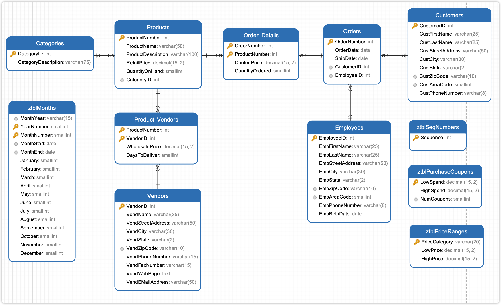
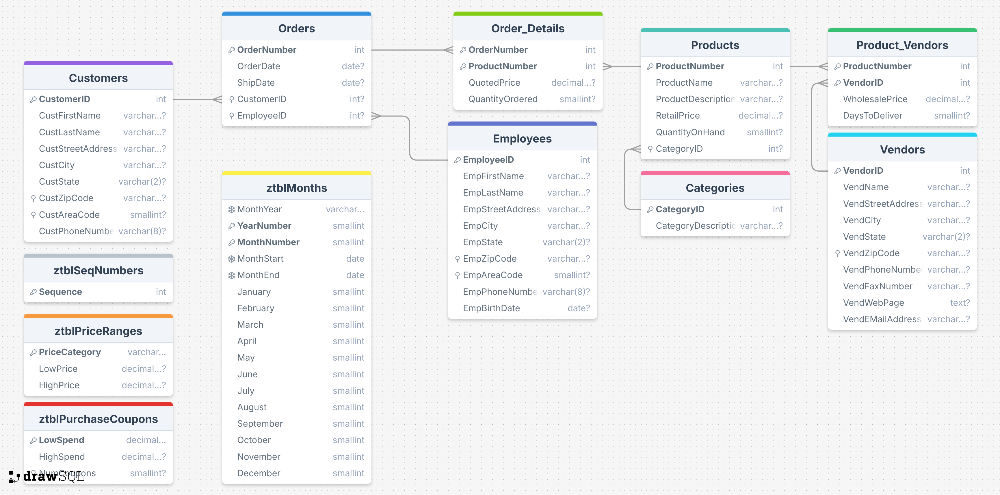

# SalesOrdersExample

SalesOrdersExample 是 `SQL 查询：从入门到实践（第４版）` 提供的示例数据库。

## 导入数据

使用 `shcema.SQL` 文件导入建表语句，使用 `data.SQL` 导入数据，使用 `views.SQL` 导入视图等文件，对于 `views.SQL` 创建视图文件，也可以暂时不导入。

> [!CAUTION]
> DrawSQL 疑似不支持 ADD CONSTRINAT 语句，可以删除该关键词，直接使用 Foreign Key 关键词。或者直接使用本文档同目录下 [schema-for-drawsql.sql](./schema-for-drawsql.sql) 文件。

```sh
mysql -uroot -p12345 < "schema.SQL"
mysql -uroot -p12345 < "data.SQL"
```

导入数据到 Mysql 容器中，首先需要将文件拷贝到容器中：

```sh
docker exec -it container_name mysql -uroot -p12345 -t < /path/to/schema.SQL
docker exec -it container_name mysql -uroot -p12345 -t < /path/to/data.SQL
```

## ERD 关系图




或者直接访问 [DrawSQL](https://drawsql.app/teams/sql-404/diagrams/salesordersexample)，查看 ERD 关系图。

## 表字段注释

数据库包含 11 张表：

- `Products`
  - `ProductNumber` 商品 ID
  - `ProductName` 商品名称
  - `ProductDescription` 商品描述
  - `RetailPrice`
  - `QuantityOnHand`
  - `CategoryID` 分类 ID

## 练习

<details style="padding: 8px 20px; margin-bottom: 20px; background-color: rgba(142, 150, 170, 0.14);">
<summary markdown="span">#8.4.1 使用内连接，显示所有商品及其所属的类别</summary>

返回 40 条记录：

```sql
select ProductName, Categories.CategoryDescription
from Products
inner join Categories
on Products.CategoryID = Categories.CategoryID;
```

</details>

<details style="padding: 8px 20px; margin-bottom: 20px; background-color: rgba(142, 150, 170, 0.14);">
<summary markdown="span">#8.4.2 使用内连接，找出所有订购了自行车头盔的顾客</summary>

由于顾客可能多次订购头盔，因此使用了关键字 DISTINCT 来消除重复行。

返回 25 条记录：

```sql
select DISTINCT Customers.CustomerID, Customers.CustLastName, Customers.CustFirstName
from Orders
inner join Customers
on Orders.CustomerID = Customers.CustomerID
inner join Order_Details
on Orders.OrderNumber = Order_Details.OrderNumber
inner join Products
on Order_Details.ProductNumber = Products.ProductNumber
where ProductName like '%helmet%';
```

书中示例，返回 25 条记录:

```sql
SELECT DISTINCT Customers.CustFirstName, Customers.CustLastName
FROM (
  (
    Customers
    INNER JOIN Orders
    ON Customers.CustomerID = Orders.CustomerID
  )
  INNER JOIN Order_Details
  ON Orders.OrderNumber = Order_Details.OrderNumber
)
INNER JOIN Products
ON Products.ProductNumber = Order_Details.ProductNumber
WHERE Products.ProductName LIKE '%Helmet%';
```

</details>

<details style="padding: 8px 20px; margin-bottom: 20px; background-color: rgba(142, 150, 170, 0.14);">
<summary markdown="span">#8.4.3 使用内连接，找出所有订购了自行车和头盔的顾客</summary>

可以将需求拆分成，购买了自行车的顾客和购买了头盔的顾客的交集。

查询购买了自行车的顾客，返回 909 条记录：

```sql
select Customers.CustomerID
from Customers
inner join Orders
on Orders.CustomerID = Customers.CustomerID
inner join Order_Details
on Orders.OrderNumber = Order_Details.OrderNumber
inner join Products
on Order_Details.ProductNumber = Products.ProductNumber
where Products.ProductName like '%Bike';
```

查询购买了头盔的顾客，返回 279 条记录：

```sql
select Customers.CustomerID
from Customers
inner join Orders
on Orders.CustomerID = Customers.CustomerID
inner join Order_Details
on Orders.OrderNumber = Order_Details.OrderNumber
inner join Products
on Order_Details.ProductNumber = Products.ProductNumber
where Products.ProductName like '%Helmet';
```

对两个结果集派生表 Derived Table 使用 inner join 取交集，返回 21 条记录：

```sql
SELECT distinct A.CustomerID, A.CustFirstName, A.CustLastName
FROM (
	SELECT Customers.CustomerID,
	Customers.CustFirstName, Customers.CustLastName
	FROM Customers
	INNER JOIN Orders ON Orders.CustomerID = Customers.CustomerID
	INNER JOIN Order_Details ON Orders.OrderNumber = Order_Details.OrderNumber
	INNER JOIN Products ON Order_Details.ProductNumber = Products.ProductNumber
	WHERE Products.ProductName LIKE '%Bike'
) AS A
INNER JOIN (
	SELECT Customers.CustomerID
	FROM Customers
	INNER JOIN Orders ON Orders.CustomerID = Customers.CustomerID
	INNER JOIN Order_Details ON Orders.OrderNumber = Order_Details.OrderNumber
	INNER JOIN Products ON Order_Details.ProductNumber = Products.ProductNumber
	WHERE Products.ProductName LIKE '%Helmet'
) AS B
on A.CustomerID = B.CustomerID;
```

书中示例，返回 21 条记录：

```sql
SELECT CustBikes.CustFirstName,
   CustBikes.CustLastName
FROM
   (SELECT DISTINCT Customers.CustomerID,
      Customers.CustFirstName,
      Customers.CustLastName
    FROM ((Customers
    INNER JOIN Orders
      ON Customers.CustomerID
        = Orders.CustomerID)
    INNER JOIN Order_Details
      ON Orders.OrderNumber =
        Order_Details.OrderNumber)
    INNER JOIN Products
      ON Products.ProductNumber =
      Order_Details.ProductNumber
    WHERE Products.ProductName LIKE '%Bike')
  AS CustBikes
INNER JOIN
  (SELECT DISTINCT Customers.CustomerID
    FROM ((Customers
    INNER JOIN Orders
      ON Customers.CustomerID =
         Orders.CustomerID)
    INNER JOIN Order_Details
      ON Orders.OrderNumber =
         Order_Details.OrderNumber)
    INNER JOIN Products
      ON Products.ProductNumber =
         Order_Details.ProductNumber
    WHERE Products.ProductName LIKE '%Helmet')
      AS CustHelmets
ON CustBikes.CustomerID =
   CustHelmets.CustomerID;
```

</details>

<details style="padding: 8px 20px; margin-bottom: 20px; background-color: rgba(142, 150, 170, 0.14);">
<summary markdown="span">#8.6 使用内连接，列出顾客及其下单日期，并按下单日期排序</summary>

返回 994 条记录：

```sql
select
Customers.CustomerID,
concat(Customers.CustFirstName, ',', Customers.CustLastName) as CustomerName,
OrderDate
from Customers
inner join Orders
on Customers.CustomerID = Orders.CustomerID
order by Orders.OrderDate, Customers.CustomerID;
```

</details>
<details style="padding: 8px 20px; margin-bottom: 20px; background-color: rgba(142, 150, 170, 0.14);">
<summary markdown="span">#8.6 列出员工及其为哪些顾客下了订单</summary>

返回 211 条记录：

```sql
select DISTINCT
CONCAT(Employees.EmpFirstName,',',Employees.EmpLastName) as EmployeesName,
CONCAT(Customers.CustFirstName, ',', Customers.CustLastName) as CustomerName
from Employees
inner join Orders
on Employees.EmployeeID = Orders.EmployeeID
inner join Customers
on Orders.CustomerID = Customers.CustomerID
```

</details>
<details style="padding: 8px 20px; margin-bottom: 20px; background-color: rgba(142, 150, 170, 0.14);">
<summary markdown="span">#8.6 显示所有的订单、每个订单包含的商品以及每种商品的库存量，并按订单号排序</summary>

返回 3973 条记录：

```sql
select
distinct Orders.OrderNumber,
Products.ProductNumber,
ProductName,
Products.QuantityOnHand
ProductNumber
from Orders
inner join Order_Details
on Orders.OrderNumber = Order_Details.OrderNumber
inner join Products
on Products.ProductNumber = Order_Details.ProductNumber
order by Orders.OrderNumber;
```

</details>
<details style="padding: 8px 20px; margin-bottom: 20px; background-color: rgba(142, 150, 170, 0.14);">
<summary markdown="span">#8.6 使用内连接，显示供应商及其提供的价格低于 100 美元的商品</summary>

返回 66 条记录：

```sql
select *
from Products
inner join Product_Vendors
on Products.ProductNumber = Product_Vendors.ProductNumber
inner join Vendors
on Product_Vendors.VendorID = Vendors.VendorID
where Product_Vendors.WholesalePrice < 100;
```

</details>
<details style="padding: 8px 20px; margin-bottom: 20px; background-color: rgba(142, 150, 170, 0.14);">
<summary markdown="span">#8.6 使用内连接，列出同姓的顾客和员工</summary>

返回 16 条记录：

```sql
select Customers.CustFirstName, Customers.CustLastName, Employees.EmpFirstName, Employees.EmpLastName from Customers
inner join Employees
on Customers.CustLastName = Employees.EmpLastName;
```

</details>

<details style="padding: 8px 20px; margin-bottom: 20px; background-color: rgba(142, 150, 170, 0.14);">
<summary markdown="span">#8.6 使用内连接，列出居住在同一座城市的顾客和员工</summary>

返回 10 条记录：

```sql
select DISTINCT
Customers.CustFirstName, Customers.CustLastName,
Employees.EmpFirstName, Employees.EmpLastName,
Customers.CustCity, Employees.EmpCity
from Customers
inner join Employees
on Customers.CustCity = Employees.EmpCity;
```

</details>
