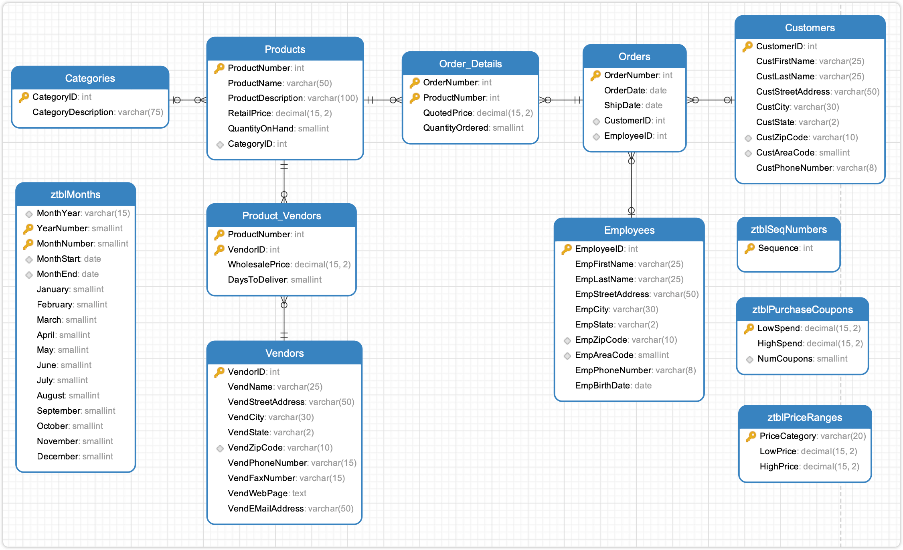

# SalesOrdersExample

SalesOrdersExample 是 `SQL 查询：从入门到实践（第４版）` 提供的示例数据库。

## 导入数据

使用 `schema.SQL` 文件导入建表语句，使用 `data.SQL` 导入数据。

`view.sql` 是书中提供的参考答案，以创建视图的形式保存在 SQL 文件中，可以参考，意义不大，也用不上。

> [!CAUTION]
> DrawSQL 疑似不支持 ADD CONSTRINAT 语句，可以删除该关键词，直接使用 Foreign Key 关键词。或者直接使用本文档同目录下 [schema-for-drawsql.sql](./schema-for-drawsql.sql) 文件。

```sh
mysql -uroot -p12345 < "schema.SQL"
mysql -uroot -p12345 < "data.SQL"
```

导入数据到 Mysql 容器中，首先需要将文件拷贝到容器中：

```sh
docker exec -it container_name mysql -uroot -p12345 -t < /path/to/schema.SQL
docker exec -it container_name mysql -uroot -p12345 -t < /path/to/data.SQL
```

## ERD 关系图




或者直接访问 [DrawSQL](https://drawsql.app/teams/sql-404/diagrams/salesordersexample)，查看 ERD 关系图。

## 表字段注释

数据库包含 12 张表：

- `Products`
  - `ProductNumber` 商品 ID
  - `ProductName` 商品名称
  - `ProductDescription` 商品描述
  - `RetailPrice` 零售价格
  - `QuantityOnHand` 库存数量
  - `CategoryID` 分类 ID
- `Vendors` 产品供应商表
  - `VendorID` 供应商 ID
  - `VendName` 供应商名称
  - `VendStreetAddress` 供应商街道地址
  - `VendState` 供应商所在州
  - `VendZipCode` 供应商邮政编码
  - `VendPhoneNumber` 供应商电话号码
  - `VendFaxNumber` 供应商传真号码
  - `VendWebPage` 供应商网站地址
  - `VendEMailAddress` 供应商邮件地址
- `Product_Vendors` 产品和供应商中间表 linking table
  - `ProductNumber` 产品 id
  - `VendorID` 供应商 id
  - `WholesalePrice` 产品批发价格
  - `DaysToDeliver` 产品从供应商订单到交货天数
- `Categories` 产品分类表
  - `CategoryID` 分类 id
  - `CategoryDescription` 分类名称
- `Customers` 用户表
  - `CustStreetAddress` 客户的街道地址。
  - `CustCity` 客户所在的城市。
  - `CustState` 客户所在的州的缩写。
  - `CustZipCode` 客户的邮政编码。
  - `CustAreaCode` 客户的电话号码区号。
  - `CustPhoneNumber` 客户的电话号码。
- `Employees` 员工表
  - `EmpStreetAddress` 员工的街道地址。
  - `EmpCity` 员工所在的城市。
  - `EmpState` 员工所在的州的缩写。
  - `EmpZipCode` 员工的邮政编码。
  - `EmpAreaCode` 员工的电话号码区号。
  - `EmpPhoneNumber` 员工的电话号码。
  - `EmpBirthDate` 员工的出生日期。
- `Orders`
  - `OrderNumber` 订单 ID
  - `OrderDate` 下单日期
  - `ShipDate` 发货日期
  - `CustomerID` 订单的用户 ID
  - `EmployeeID` 生成订单的员工 ID
- `Order_Details`
  - `QuotedPrice` 产品下单价格
  - `QuantityOrdered` 产品下单数量
- `ztblMonths`
  - `MonthYear` 月份和年份的组合，例如 "January 2023"。
  - `YearNumber` 年份。
  - `MonthNumber` 月份的数字表示，例如 1 表示一月。
  - `MonthStart` 该月的开始日期。
  - `MonthEnd` 该月的结束日期。
  - `January` December: 用于表示每个月的特定数据。
- `ztblPriceRanges`
  - `PriceCategory` 价格类别的描述，用于分组产品或订单的价格范围。
  - `LowPrice` 该价格类别的最低价格。
  - `HighPrice` 该价格类别的最高价格。
- `ztblPurchaseCoupons`
  `LowSpend` 使用优惠券所需的最低花费。
  `HighSpend` 使用优惠券的最高花费。
  `NumCoupons` 客户在该花费范围内可获得的优惠券数量。
- `ztblSeqNumbers`
  - `Sequence` 序列号，用于在系统中生成唯一的数字序列

## 练习

<details style="padding: 8px 20px; margin-bottom: 20px; background-color: rgba(142, 150, 170, 0.14);">
<summary markdown="span">#8.4.1 使用内连接，显示所有商品及其所属的类别</summary>

需求分析，获取 `所有` 商品，即在没有外键为 NULL 的情况下，可以使用内连接。如果外键可能存在为 NULL 的情况，则需要使用左外连接。

返回 40 条记录：

```sql
select ProductName, Categories.CategoryDescription
from Products
inner join Categories
on Products.CategoryID = Categories.CategoryID;
```

书中示例同上，可参考 view.sql 文件中 CH08_Products_And_Categories。

</details>

<details style="padding: 8px 20px; margin-bottom: 20px; background-color: rgba(142, 150, 170, 0.14);">
<summary markdown="span">#8.4.2 使用内连接，找出所有订购了自行车头盔的顾客</summary>

需求分析，获取 `所有` 顾客，即在没有外键为 NULL 的情况下，可以使用内连接。如果外键可能存在为 NULL 的情况，则需要使用左外连接。而限制条件 `订购了自行车头盔`，就排除了所有外键为 NULL 的情况，所以此例使用内连接。

由于顾客可能多次订购头盔，因此使用了关键字 DISTINCT 来消除重复行。

返回 25 条记录：

```sql
select DISTINCT Customers.CustomerID, Customers.CustLastName, Customers.CustFirstName
from Orders
inner join Customers
on Orders.CustomerID = Customers.CustomerID
inner join Order_Details
on Orders.OrderNumber = Order_Details.OrderNumber
inner join Products
on Order_Details.ProductNumber = Products.ProductNumber
where ProductName like '%helmet%';
```

书中示例，返回 25 条记录，可参考 view.sql 文件中 CH08_Customers_Who_Ordered_Helmets:

```sql
SELECT DISTINCT Customers.CustFirstName, Customers.CustLastName
FROM (
  (
    Customers
    INNER JOIN Orders
    ON Customers.CustomerID = Orders.CustomerID
  )
  INNER JOIN Order_Details
  ON Orders.OrderNumber = Order_Details.OrderNumber
)
INNER JOIN Products
ON Products.ProductNumber = Order_Details.ProductNumber
WHERE Products.ProductName LIKE '%Helmet%';
```

</details>

<details style="padding: 8px 20px; margin-bottom: 20px; background-color: rgba(142, 150, 170, 0.14);">
<summary markdown="span">#8.4.3 使用内连接，找出所有订购了自行车和头盔的顾客</summary>

需求分析，可以将需求拆分成，购买了自行车的顾客和购买了头盔的顾客的交集。所有购买了自行车的顾客，参考上例，由于条件中排除了外键为 NULL 的情况，所以使用内连接。所有订购了头盔的顾客是一样的逻辑，使用内连接获取，然后取这两个结果集的交集即可。

查询购买了自行车的顾客，返回 909 条记录：

```sql
select Customers.CustomerID
from Customers
inner join Orders
on Orders.CustomerID = Customers.CustomerID
inner join Order_Details
on Orders.OrderNumber = Order_Details.OrderNumber
inner join Products
on Order_Details.ProductNumber = Products.ProductNumber
where Products.ProductName like '%Bike';
```

查询购买了头盔的顾客，返回 279 条记录：

```sql
select Customers.CustomerID
from Customers
inner join Orders
on Orders.CustomerID = Customers.CustomerID
inner join Order_Details
on Orders.OrderNumber = Order_Details.OrderNumber
inner join Products
on Order_Details.ProductNumber = Products.ProductNumber
where Products.ProductName like '%Helmet';
```

对两个结果集派生表 Derived Table 使用 inner join 取交集，返回 21 条记录：

```sql
SELECT distinct A.CustomerID, A.CustFirstName, A.CustLastName
FROM (
	SELECT Customers.CustomerID,
	Customers.CustFirstName, Customers.CustLastName
	FROM Customers
	INNER JOIN Orders ON Orders.CustomerID = Customers.CustomerID
	INNER JOIN Order_Details ON Orders.OrderNumber = Order_Details.OrderNumber
	INNER JOIN Products ON Order_Details.ProductNumber = Products.ProductNumber
	WHERE Products.ProductName LIKE '%Bike'
) AS A
INNER JOIN (
	SELECT Customers.CustomerID
	FROM Customers
	INNER JOIN Orders ON Orders.CustomerID = Customers.CustomerID
	INNER JOIN Order_Details ON Orders.OrderNumber = Order_Details.OrderNumber
	INNER JOIN Products ON Order_Details.ProductNumber = Products.ProductNumber
	WHERE Products.ProductName LIKE '%Helmet'
) AS B
on A.CustomerID = B.CustomerID;
```

书中示例，返回 21 条记录，可参考 view.sql 文件中 CH08_Customers_Both_Bikes_And_Helmets：

```sql
SELECT CustBikes.CustFirstName,
   CustBikes.CustLastName
FROM
   (SELECT DISTINCT Customers.CustomerID,
      Customers.CustFirstName,
      Customers.CustLastName
    FROM ((Customers
    INNER JOIN Orders
      ON Customers.CustomerID
        = Orders.CustomerID)
    INNER JOIN Order_Details
      ON Orders.OrderNumber =
        Order_Details.OrderNumber)
    INNER JOIN Products
      ON Products.ProductNumber =
      Order_Details.ProductNumber
    WHERE Products.ProductName LIKE '%Bike')
  AS CustBikes
INNER JOIN
  (SELECT DISTINCT Customers.CustomerID
    FROM ((Customers
    INNER JOIN Orders
      ON Customers.CustomerID =
         Orders.CustomerID)
    INNER JOIN Order_Details
      ON Orders.OrderNumber =
         Order_Details.OrderNumber)
    INNER JOIN Products
      ON Products.ProductNumber =
         Order_Details.ProductNumber
    WHERE Products.ProductName LIKE '%Helmet')
      AS CustHelmets
ON CustBikes.CustomerID =
   CustHelmets.CustomerID;
```

</details>

<details style="padding: 8px 20px; margin-bottom: 20px; background-color: rgba(142, 150, 170, 0.14);">
<summary markdown="span">#8.6 使用内连接，列出顾客及其下单日期，并按下单日期排序</summary>

返回 994 条记录：

```sql
select
Customers.CustomerID,
concat(Customers.CustFirstName, ',', Customers.CustLastName) as CustomerName,
OrderDate
from Customers
inner join Orders
on Customers.CustomerID = Orders.CustomerID
order by Orders.OrderDate, Customers.CustomerID;
```

书中示例同上，可参考 view.sql 文件中 CH08_Customers_And_OrderDates

</details>
<details style="padding: 8px 20px; margin-bottom: 20px; background-color: rgba(142, 150, 170, 0.14);">
<summary markdown="span">#8.6 使用内连接，列出员工及其为哪些顾客下了订单</summary>

返回 211 条记录：

```sql
select DISTINCT
CONCAT(Employees.EmpFirstName,',',Employees.EmpLastName) as EmployeesName,
CONCAT(Customers.CustFirstName, ',', Customers.CustLastName) as CustomerName
from Employees
inner join Orders
on Employees.EmployeeID = Orders.EmployeeID
inner join Customers
on Orders.CustomerID = Customers.CustomerID
```

书中示例同上，可参考 view.sql 文件中 CH08_Employees_And_Customers

</details>
<details style="padding: 8px 20px; margin-bottom: 20px; background-color: rgba(142, 150, 170, 0.14);">
<summary markdown="span">#8.6 显示所有的订单、每个订单包含的商品以及每种商品的库存量，并按订单号排序</summary>

返回 3973 条记录：

```sql
select
distinct Orders.OrderNumber,
Products.ProductNumber,
ProductName,
Products.QuantityOnHand
ProductNumber
from Orders
inner join Order_Details
on Orders.OrderNumber = Order_Details.OrderNumber
inner join Products
on Products.ProductNumber = Order_Details.ProductNumber
order by Orders.OrderNumber;
```

书中示例同上，可参考 view.sql 文件中 CH08_Orders_With_Products

</details>
<details style="padding: 8px 20px; margin-bottom: 20px; background-color: rgba(142, 150, 170, 0.14);">
<summary markdown="span">#8.6 使用内连接，显示供应商及其提供的价格低于 100 美元的商品</summary>

返回 66 条记录：

```sql
select *
from Products
inner join Product_Vendors
on Products.ProductNumber = Product_Vendors.ProductNumber
inner join Vendors
on Product_Vendors.VendorID = Vendors.VendorID
where Product_Vendors.WholesalePrice < 100;
```

书中示例同上，可参考 view.sql 文件中 CH08_Vendors_And_Products_Less_Than_100

</details>
<details style="padding: 8px 20px; margin-bottom: 20px; background-color: rgba(142, 150, 170, 0.14);">
<summary markdown="span">#8.6 使用内连接，列出同姓的顾客和员工</summary>

返回 16 条记录：

```sql
select Customers.CustFirstName, Customers.CustLastName, Employees.EmpFirstName, Employees.EmpLastName from Customers
inner join Employees
on Customers.CustLastName = Employees.EmpLastName;
```

书中示例同上，可参考 view.sql 文件中 CH08_Customers_Employees_Same_LastName

</details>

<details style="padding: 8px 20px; margin-bottom: 20px; background-color: rgba(142, 150, 170, 0.14);">
<summary markdown="span">#8.6 使用内连接，列出居住在同一座城市的顾客和员工</summary>

返回 10 条记录：

```sql
select DISTINCT
Customers.CustFirstName, Customers.CustLastName,
Employees.EmpFirstName, Employees.EmpLastName,
Customers.CustCity, Employees.EmpCity
from Customers
inner join Employees
on Customers.CustCity = Employees.EmpCity;
```

书中示例同上，可参考 view.sql 文件中 CH08_Customers_Employees_Same_City

</details>

<details style="padding: 8px 20px; margin-bottom: 20px; background-color: rgba(142, 150, 170, 0.14);">
<summary markdown="span">#9.5 使用左外连接，查询哪些商品从未被订购过</summary>

返回 2 条记录：

```sql
SELECT
Products.ProductNumber,
Products.ProductName,
Order_Details.OrderNumber
FROM Products
LEFT OUTER JOIN Order_Details
ON Products.ProductNumber =
Order_Details.ProductNumber
WHERE Order_Details.OrderNumber IS NULL;
```

书中示例同上，可参考 view.sql 文件中 CH09_Products_Never_Ordered。

</details>
<details style="padding: 8px 20px; margin-bottom: 20px; background-color: rgba(142, 150, 170, 0.14);">
<summary markdown="span">#9.5 使用左外连接，查询所有顾客及其自行车订单</summary>

首先上来就是万能 left join 大法，手写 **`错误`** 示例，返回 909 条记录：

```sql
-- 这是错误示例
select *
from Customers
left join Orders
on Customers.CustomerID = Orders.CustomerID
left join Order_Details
on Orders.OrderNumber = Order_Details.OrderNumber
left join Products
on Order_Details.ProductNumber = Products.ProductNumber
left join Categories
on Products.CategoryID = Categories.CategoryID
where Categories.CategoryDescription = 'Bikes';
```

MySQL 查询语句的执行顺序

- `5.select column, 5.2 distinct, 5.3 top`
- `1.from`
- `2.where`
- `3.group by`
- `4.having`
- `6.order by`
- `limit,offset`

尽管使用左连接，想留住 Customers 表中没有下单，甚至没有下单 Bikes 的用户，但到了最后，一条 **`where`** 筛选就将没有买 Bikes 的客户过滤掉，更别说没有下单任何产品的用户。

所以 Where 过滤掉的应该是还没有包含 Customers 表信息的数据，然后在和 Customer 连表。将上述 SQL 稍作修改，将 Customers 之后的结果集用括号包起来。

返回 914 条记录：

```sql
select *
from Customers
left join (
  SELECT Orders.CustomerID
  from Orders
  left join Order_Details
  on Orders.OrderNumber = Order_Details.OrderNumber
  left join Products
  on Order_Details.ProductNumber = Products.ProductNumber
  left join Categories
  on Products.CategoryID = Categories.CategoryID
  where Categories.CategoryDescription = 'Bikes'
) as A
on Customers.CustomerID = A.CustomerID
```

书中示例，返回 914 条记录，可参考 view.sql 文件中 CH09_All_Customers_And_Any_Bike_Orders：

```sql
select
Customers.CustFirstName,
Customers.CustLastName,
A.OrderNumber,
A.ProductNumber,
A.OrderDate,
A.QuantityOrdered,
A.QuotedPrice
from Customers
left join (
	select Orders.CustomerID, Orders.OrderDate, Orders.OrderNumber,
	Products.ProductNumber, Order_Details.QuantityOrdered, Order_Details.QuotedPrice
	from Orders
	inner join Order_Details
		on Orders.OrderNumber = Order_Details.OrderNumber
	inner join Products
		on Order_Details.ProductNumber = Products.ProductNumber
	inner join Categories
		on Products.CategoryID = Categories.CategoryID
	where Categories.CategoryDescription = 'Bikes'
) as A
on Customers.CustomerID = A.CustomerID;
```

</details>

<details style="padding: 8px 20px; margin-bottom: 20px; background-color: rgba(142, 150, 170, 0.14);">
<summary markdown="span">#9.7 使用外连接，列出从未订购过头盔的顾客</summary>

返回 3 条记录：

```sql
select Customers.CustFirstName, Customers.CustLastName
from Customers
left join (
	select Orders.CustomerID
	from Orders
	inner join Order_Details
	on Orders.OrderNumber = Order_Details.OrderNumber
	inner join Products
	on Order_Details.ProductNumber = Products.ProductNumber
	where Products.ProductName like '%Helmet'
) as HelmetOrder
on Customers.CustomerID = HelmetOrder.CustomerID
where HelmetOrder.CustomerID is NUll;
```

书中示例同上，可参考 view.sql 文件中 CH09_Customers_No_Helmets

</details>
<details style="padding: 8px 20px; margin-bottom: 20px; background-color: rgba(142, 150, 170, 0.14);">
<summary markdown="span">#9.7 使用外连接，显示没有任何销售代表(员工)的邮政编码与其相同的顾客</summary>

返回 18 条记录：

```sql
select Customers.CustomerID, Customers.CustFirstName, Customers.CustLastName
from Customers
left join Employees
on Customers.CustZipCode = Employees.EmpZipCode
where Employees.EmpZipCode is NULL;
```

书中示例同上，可参考 view.sql 文件中 CH09_Customers_No_Rep_Same_Zip

</details>
<details style="padding: 8px 20px; margin-bottom: 20px; background-color: rgba(142, 150, 170, 0.14);">
<summary markdown="span">#9.7 使用外连接，列出所有的商品及包含它的订单的日期</summary>

查看错误示例：

```sql
-- 这是错误示例
select  ProductName, ood.OrderDate
from Products
left join (
	select distinct Orders.CustomerID, Order_Details.ProductNumber, Orders.OrderDate
	from Orders
	inner join Order_Details
	on Orders.OrderNumber = Order_Details.OrderNumber
) as ood
on Products.ProductNumber = ood.ProductNumber;
```

一个 DISTINCT 引发的错误，上述 SQL 将连表的主键作为 DISTINCT 去重对象，将结果集所有的内容保存下来了，订单用户 id，订单日期，订单详情产品 id。而需求只要产品和日期，不同的用户可能在同一天对同一个产品进行下单，所以导致上述结果集还包含了用户信息。需求中只要求商品和订单日期，所以需要排除用户，进一步去重。

返查看正确示例，回 2681 条记录：

```sql
select  ProductName, ood.OrderDate
from Products
left join (
	select distinct Order_Details.ProductNumber, Orders.OrderDate
	from Orders
	inner join Order_Details
	on Orders.OrderNumber = Order_Details.OrderNumber
) as ood
on Products.ProductNumber = ood.ProductNumber;
```

书中示例同上，可参考 view.sql 文件中 CH09_All_Products_Any_Order_Dates

</details>

**`union 自带去重效果，union all 则不会去重。`**

<details style="padding: 8px 20px; margin-bottom: 20px; background-color: rgba(142, 150, 170, 0.14);">
<summary markdown="span">#10.2 使用 union，生成单个邮寄清单，其中包含顾客的姓名、地址、城市、州和邮政编码以及供应商的名称、地址、城市、州和邮政编码。</summary>

需求分析，比如中秋节，企业需要给客户以及供应商送月饼，所以需要获取这两个不相干的表的地址并集。

书中示例，返回 38 条记录：

```sql
SELECT
concat(CustLastName, ', ', CustFirstName) AS MailingName,
CustStreetAddress, CustCity, CustState,CustZipCode
FROM Customers UNION
SELECT VendName, VendStreetAddress, VendCity, VendState, VendZipCode
FROM Vendors
```

</details>

<details style="padding: 8px 20px; margin-bottom: 20px; background-color: rgba(142, 150, 170, 0.14);">

<summary markdown="span">#10.2 使用 union，列出顾客及其订购的自行车以及供应商及其销售的自行车。</summary>

很明显是顾客订购的自行车订单，以及供应商销售的自行车的并集。

书中示例，返回 119 条记录：

```sql
SELECT concat( Customers.CustLastName, ', ', Customers.CustFirstName ) AS FullName,
Products.ProductName, 'Customer' AS RowID
FROM(
	(
		Customers
		INNER JOIN Orders
		ON Customers.CustomerID = Orders.CustomerID
	)
	INNER JOIN Order_Details ON Orders.OrderNumber = Order_Details.OrderNumber
)
INNER JOIN Products
ON Products.ProductNumber = Order_Details.ProductNumber
WHERE Products.ProductName LIKE '%bike%'
UNION
SELECT Vendors.VendName, Products.ProductName, 'Vendor' AS RowID
FROM (
	Vendors
	INNER JOIN Product_Vendors ON Vendors.VendorID = Product_Vendors.VendorID
)
INNER JOIN Products
ON Products.ProductNumber = Product_Vendors.ProductNumber
WHERE Products.ProductName LIKE '%bike%'
```

</details>
<details style="padding: 8px 20px; margin-bottom: 20px; background-color: rgba(142, 150, 170, 0.14);">
<summary markdown="span">#10.2 使用 union，生成一个包含顾客、员工和供应商的邮寄清单。</summary>

很明显是顾客订购的自行车订单，以及供应商销售的自行车的并集。

书中示例，返回 45 条记录：

```sql
SELECT
	concat(Customers.CustFirstName, ' ', Customers.CustLastName) AS CustFullName,
	Customers.CustStreetAddress,
	Customers.CustCity,
	Customers.CustState,
	Customers.CustZipCode,
	'customer' as type
FROM Customers
UNION
SELECT
	concat(Employees.EmpFirstName, ' ', Employees.EmpLastName) AS EmpFullName,
	Employees.EmpStreetAddress,
	Employees.EmpCity,
	Employees.EmpState,
	Employees.EmpZipCode,
	'employees' as type
FROM Employees
UNION
SELECT
	Vendors.VendName,
	Vendors.VendStreetAddress,
	Vendors.VendCity,
	Vendors.VendState,
	Vendors.VendZipCode,
	'vendors' as type
FROM Vendors
```

</details>
<details style="padding: 8px 20px; margin-bottom: 20px; background-color: rgba(142, 150, 170, 0.14);">
<summary markdown="span">#10.2 使用 union，生成一个包含顾客、员工和供应商的邮寄清单，并按照邮政编码排序。</summary>

此结果集中，order by 并不是最后一个 select 语句的排序语句，而是整个结果集的排序语句。

书中示例，返回 45 条记录：

```sql
SELECT
	concat(Customers.CustFirstName, ' ', Customers.CustLastName) AS CustFullName,
	Customers.CustStreetAddress,
	Customers.CustCity,
	Customers.CustState,
	Customers.CustZipCode,
FROM Customers
UNION
SELECT
	concat(Employees.EmpFirstName, ' ', Employees.EmpLastName) AS EmpFullName,
	Employees.EmpStreetAddress,
	Employees.EmpCity,
	Employees.EmpState,
	Employees.EmpZipCode,
FROM Employees
UNION
SELECT
	Vendors.VendName,
	Vendors.VendStreetAddress,
	Vendors.VendCity,
	Vendors.VendState,
	Vendors.VendZipCode,
FROM Vendors
ORDER BY CustZipCode; -- [!code ++]
```

也可以按照字段的序列号来排序，zipcode 的字段排第 5

```sql
ORDER BY CustZipCode; -- [!code --]
ORDER BY 5 -- [!code ++]
```

</details>
<details style="padding: 8px 20px; margin-bottom: 20px; background-color: rgba(142, 150, 170, 0.14);">
<summary markdown="span">#10.4 使用 union all，列出所有顾客和员工的姓名和地址(包括重复的内容)，并按邮政编码排序。</summary>

书中示例，返回 36 条记录，可参考 view.sql 文件中 CH10_Customers_UNION_ALL_Employees：

```sql
SELECT Customers.CustFirstName, Customers.CustLastName,
Customers.CustStreetAddress,
Customers.CustCity,
Customers.CustState, Customers.CustZipCode
FROM Customers
UNION ALL
SELECT Employees.EmpFirstName,Employees.EmpLastName,
Employees.EmpStreetAddress, Employees.EmpCity,
Employees.EmpState, Employees.EmpZipCode
FROM Employees
ORDER BY CustZipCode
```

</details>
<details style="padding: 8px 20px; margin-bottom: 20px; background-color: rgba(142, 150, 170, 0.14);">
<summary markdown="span">#10.4 使用 union，列出所有订购了自行车的顾客，还有所有订购了头盔的员工。</summary>

书中示例，返回 52 条记录，可参考 view.sql 文件中 CH10_Customer_Order_Bikes_UNION_Customer_Order_Helmets：

```sql
SELECT Customers.CustFirstName, Customers.CustLastName, 'Bike' AS ProdType
FROM	(
	(
		Customers
		INNER JOIN Orders ON Customers.CustomerID = Orders.CustomerID
	)
	INNER JOIN Order_Details ON Orders.OrderNumber = Order_Details.OrderNumber
)
INNER JOIN Products
ON Products.ProductNumber = Order_Details.ProductNumber
WHERE Products.ProductName LIKE '%bike%'
UNION
SELECT Customers.CustFirstName, Customers.CustLastName, 'Helmet' AS ProdType
FROM (
	(
		Customers
		INNER JOIN Orders
		ON Customers.CustomerID = Orders.CustomerID
	)
	INNER JOIN Order_Details
	ON Orders.OrderNumber = Order_Details.OrderNumber
)
INNER JOIN Products
ON Products.ProductNumber = Order_Details.ProductNumber
WHERE Products.ProductName LIKE '%helmet%'
```

可以使用 where 子句来处理并集的问题，并且 Mysql 对此有优化，比 union 性能高效很多。

书中示例 2，返回 52 条记录，可参考 view.sql 文件中 CH10_Customer_Order_Bikes_UNION_Customer_Order_Helmets：

```sql
SELECT DISTINCT
	Customers.CustFirstName,
	Customers.CustLastName
FROM (
	(
		Customers
		INNER JOIN Orders
		ON Customers.CustomerID = Orders.CustomerID
	)
	INNER JOIN Order_Details
	ON Orders.OrderNumber = Order_Details.OrderNumber
)
	INNER JOIN Products
	ON Products.ProductNumber = Order_Details.ProductNumber
WHERE Products.ProductName LIKE '%bike%'
OR Products.ProductName LIKE '%helmet%'
```

</details>

<details style="padding: 8px 20px; margin-bottom: 20px; background-color: rgba(142, 150, 170, 0.14);">
<summary markdown="span">#11.2 列表达式中使用标量子查询，列出在 2017 年 10 月 3 日发货的所有订单以及与每个订单相关的顾客的姓</summary>

书中示例，返回 3 条记录：

```sql
SELECT
	Orders.OrderNumber,
	Orders.OrderDate,
	Orders.ShipDate,
	( SELECT Customers.CustLastName FROM Customers
		WHERE Customers.CustomerID = Orders.CustomerID  )
FROM Orders
WHERE Orders.ShipDate = '2017-10-03'
```

这是一个 `标量子查询`，作为 `列表达式的子查询`，在子查询中使用限定条件，让子查询只返回一行一列。

实际上对于这个需求，推荐使用 inner join 来使用。

书中示例，返回 3 条记录：

```sql
SELECT
	Orders.OrderNumber,
	Orders.OrderDate,
	Orders.ShipDate,
	Customers.CustLastName
FROM Customers
INNER JOIN Orders
ON Customers.CustomerID = Orders.CustomerID
WHERE Orders.ShipDate = '2017-10-03'
```

</details>
<details style="padding: 8px 20px; margin-bottom: 20px; background-color: rgba(142, 150, 170, 0.14);">
<summary markdown="span">#11.2 列表达式中使用标量子查询，列出所有顾客的姓名并计算他们各自下了多少个订单</summary>

书中示例，返回 28 条记录：

```sql
SELECT
	Customers.CustFirstName,
	Customers.CustLastName,
	(
		SELECT COUNT(*) FROM Orders
		WHERE Orders.CustomerID = Customers.CustomerID
	) AS CountOfOrders
FROM Customers;
```

这是一个 `标量子查询`，作为 `列表达式的子查询`，在子查询中使用限定条件，让子查询只返回一行一列。

</details>
<details style="padding: 8px 20px; margin-bottom: 20px; background-color: rgba(142, 150, 170, 0.14);">
<summary markdown="span">#11.2 列表达式中使用标量子查询，列出所有顾客及其最后一次下单的日期</summary>

书中示例，返回 28 条记录：

```sql
SELECT
	Customers.CustFirstName,
	Customers.CustLastName,
	(
		SELECT MAX(OrderDate) FROM Orders
		WHERE Orders.CustomerID = Customers.CustomerID
	) AS LastOrderDate
FROM Customers;
```

这是一个 `标量子查询`，作为 `列表达式的子查询`，在子查询中使用限定条件，让子查询只返回一行一列。

</details>
<details style="padding: 8px 20px; margin-bottom: 20px; background-color: rgba(142, 150, 170, 0.14);">
<summary markdown="span">#11.3 筛选器中使用标量子查询，列出所有顾客以及每位顾客最后一个订单的详情</summary>

书中示例，返回 112 条记录：

```sql
SELECT
	Customers.CustFirstName,
	Customers.CustLastName,
	Orders.OrderNumber,
	Orders.OrderDate,
	Order_Details.ProductNumber,
	Products.ProductName,
	Order_Details.QuantityOrdered
FROM (
	(
		Customers
		INNER JOIN Orders ON Customers.CustomerID = Orders.CustomerID
	)
	INNER JOIN Order_Details ON Orders.OrderNumber = Order_Details.OrderNumber
)
INNER JOIN Products ON Products.ProductNumber = Order_Details.ProductNumber
WHERE Orders.OrderDate = (
	SELECT MAX(OrderDate)
	FROM Orders AS O2
	WHERE O2.CustomerID = Customers.CustomerID
)
```

这是一个 `标量子查询`，作为 `Where子句中的子查询`，在子查询中使用限定条件，让子查询只返回一行一列。

</details>

<details style="padding: 8px 20px; margin-bottom: 20px; background-color: rgba(142, 150, 170, 0.14);">
<summary markdown="span">#11.3 筛选器中使用限定谓词 ALL，列出使用了牛肉或大蒜的菜品</summary>

书中示例，返回 4 条记录

```sql
SELECT Products.ProductName, Products.RetailPrice
FROM Products
INNER JOIN Categories
ON Products.CategoryID = Categories.CategoryID
WHERE Categories.CategoryDescription = 'Accessories'
AND Products.RetailPrice > ALL (
	SELECT Products.RetailPrice
	FROM Products
	INNER JOIN Categories
	ON Products.CategoryID = Categories.CategoryID
  WHERE  Categories.CategoryDescription = 'Clothing'
)
```

上述 SQL 中使用了表子查询和标量子查询，以及使用限定谓词 ALL 来过滤数据。

</details>
<details style="padding: 8px 20px; margin-bottom: 20px; background-color: rgba(142, 150, 170, 0.14);">
<summary markdown="span">#11.3 筛选器中使用限定谓词 EXISTS，列出使用了牛肉或大蒜的菜品</summary>

书中示例，返回 23 条记录

```sql
SELECT CustomerID, CustFirstName, CustLastName
FROM Customers
WHERE EXISTS (
	SELECT * FROM (
		Orders
		INNER JOIN Order_Details
		ON Orders.OrderNumber = Order_Details.OrderNumber
	)
	INNER JOIN Products
	ON Products.ProductNumber = Order_Details.ProductNumber
	WHERE Products.CategoryID = 2
	AND Orders.CustomerID = Customers.CustomerID
)
```

上述 SQL 中使用了表子查询和标量子查询，以及使用限定谓词 EXISTS 来过滤数据。

</details>
<details style="padding: 8px 20px; margin-bottom: 20px; background-color: rgba(142, 150, 170, 0.14);">
<summary markdown="span">#11.5.1 列表达式中使用标量子查询，列出所有的供应商及其向我们提供的商品数量</summary>

书中示例如下，返回 10 条记录，可参考 view.sql 文件中 CH11_Vendors_Product_Count：

```sql
SELECT
	VendName,
  ( SELECT COUNT(*) FROM Product_Vendors
		WHERE Product_Vendors.VendorID = Vendors.VendorID
	)
	AS VendProductCount
FROM Vendors;
```

</details>
<details style="padding: 8px 20px; margin-bottom: 20px; background-color: rgba(142, 150, 170, 0.14);">
<summary markdown="span">#11.5.2 筛选器中使用子查询，显示订购了衣服或配饰的顾客</summary>

书中示例，返回 27 条记录，可参考 view.sql 文件中 CH11_Customers_Clothing_OR_Accessories：

```sql
SELECT CustomerID, CustFirstName, CustLastName
FROM Customers
WHERE Customers.CustomerID = ANY (
	SELECT Orders.CustomerID
	FROM (
		(
			Orders
			INNER JOIN Order_Details
			ON Orders.OrderNumber = Order_Details.OrderNumber
		)
		INNER JOIN Products ON Products.ProductNumber = Order_Details.ProductNumber
	)
	INNER JOIN Categories ON Categories.CategoryID = Products.CategoryID
	WHERE Categories.CategoryDescription = 'Clothing'
	OR Categories.CategoryDescription = 'Accessories'
)
```

</details>
<details style="padding: 8px 20px; margin-bottom: 20px; background-color: rgba(142, 150, 170, 0.14);">
<summary markdown="span">#11.7 使用子查询 TODO，显示所有的商品及其最后一次被订购的日期</summary>

提示:使用聚合函数 MAX

书中示例，返回 40 条记录，可参考 view.sql 文件中 CH11_Products_Last_Date:

```sql
SELECT
	Products.ProductNumber,
	Products.ProductName,
	(	SELECT max(Orders.OrderDate)
		FROM Orders
		INNER JOIN Order_Details
		ON Orders.OrderNumber = Order_Details.OrderNumber
		WHERE Order_Details.ProductNumber = Products.ProductNumber
	)
	AS LastOrder
FROM Products;
```

</details>
<details style="padding: 8px 20px; margin-bottom: 20px; background-color: rgba(142, 150, 170, 0.14);">
<summary markdown="span">#11.7 使用子查询 TODO，列出订购了自行车的顾客</summary>

提示: 使用 IN 创建一个筛选器

书中示例，返回 23 条记录，可参考 view.sql 文件中 CH11_Customers_Ordered_Bikes_IN:

```sql
SELECT CustomerID, CustFirstName, CustLastName
FROM Customers
WHERE Customers.CustomerID IN (
	SELECT Orders.CustomerID
	FROM (
		(
			Orders
			INNER JOIN Order_Details ON Orders.OrderNumber = Order_Details.OrderNumber
		)
		INNER JOIN Products ON Products.ProductNumber = Order_Details.ProductNumber
	)
	INNER JOIN Categories ON Categories.CategoryID = Products.CategoryID
	WHERE Categories.CategoryDescription = 'Bikes'
);
```

</details>
<details style="padding: 8px 20px; margin-bottom: 20px; background-color: rgba(142, 150, 170, 0.14);">
<summary markdown="span">#11.7 使用子查询 TODO，哪些商品从未被订购过</summary>

提示: 使用 NOT IN 创建一个筛选器

书中示例，返回 2 条记录，可参考 view.sql 文件中 CH11_Products_Not_Ordered:

```sql
SELECT Products.ProductName
FROM Products
WHERE Products.ProductNumber NOT IN (
	SELECT Order_Details.ProductNumber
	FROM Order_Details
);
```

</details>
