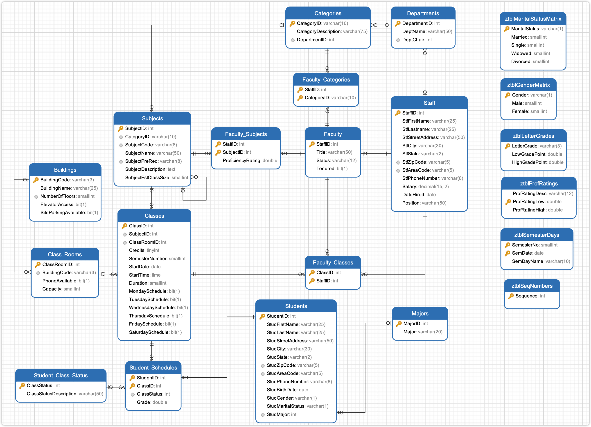

# SchoolSchedulingExample

SchoolSchedulingExample 是 `SQL 查询：从入门到实践（第４版）` 提供的示例数据库。

## 导入数据

使用 `schema.SQL` 文件导入建表语句，使用 `data.SQL` 导入数据，使用 `views.SQL` 导入视图等文件，对于 `views.SQL` 创建视图文件，也可以暂时不导入。

> [!CAUTION]
> DrawSQL 免费版仅支持 15 张表以下，所以并未提供 DrawSQL ERD 图和 SQL 文件。

```sh
mysql -uroot -p12345 < "schema.SQL"
mysql -uroot -p12345 < "data.SQL"
```

导入数据到 Mysql 容器中，首先需要将文件拷贝到容器中：

```sh
docker exec -it container_name mysql -uroot -p12345 -t < /path/to/schema.SQL
docker exec -it container_name mysql -uroot -p12345 -t < /path/to/data.SQL
```

## ERD 关系图



DrawSQL 免费版不支持 > 15 张表。

## 表字段注释

数据库包含 21 张表：

- `Subjects` 课程科目表，如数学，物理。
- `Classes` 课程安排表
  - `Credits` 学分，学完课程可以获得学分
- ## `Staff` 教职工信息表
- `Faculty` 教职工任职信息表
  - `Title` 任职信息，如教授，副教授，教授助手
  - `Status` 任职状态，离职还是在职
  - `Tenured` 是否终身任教
- `Faculty_Subjects` 教职工-课程科目表，教职工教习的科目
  - `ProficiencyRating`

## 练习

<details style="padding: 8px 20px; margin-bottom: 20px; background-color: rgba(142, 150, 170, 0.14);">
<summary markdown="span">#8.4.1 使用内连接，列出周三上课的课程所属的科目</summary>

由于同一个课程的不同部分可能安排在同一天上课，因此我使用了关键字 DISTINCT 来消除重复行。

返回 34 条记录：

```sql
select distinct SubjectName
from Classes
inner join Subjects
on Classes.SubjectID = Subjects.SubjectID
where Classes.WednesdaySchedule = 1;
```

</details>
<details style="padding: 8px 20px; margin-bottom: 20px; background-color: rgba(142, 150, 170, 0.14);">
<summary markdown="span">#8.4.3 使用内连接，列出名字相同的学生和老师</summary>

返回 2 条记录：

```sql
select concat(Students.StudFirstName, ',', Students.StudLastName),
concat(Staff.StfFirstName, ',', Staff.StfLastname)
from Students
inner join Staff
on Students.StudFirstName = Staff.StfFirstName
```

</details>

<details style="padding: 8px 20px; margin-bottom: 20px; background-color: rgba(142, 150, 170, 0.14);">
<summary markdown="span">#8.6 使用内连接，显示所有的教学楼及其中的教室</summary>

返回 47 条记录：

```sql
select Buildings.BuildingName, Class_Rooms.ClassRoomID, Class_Rooms.Capacity
from Buildings
inner join Class_Rooms
on Class_Rooms.BuildingCode = Buildings.BuildingCode;
```

</details>
<details style="padding: 8px 20px; margin-bottom: 20px; background-color: rgba(142, 150, 170, 0.14);">
<summary markdown="span">#8.6 使用内连接，列出学生及其当前注册的课程</summary>

返回 50 条记录：

```sql
select
DISTINCT Student_Schedules.StudentID,
Student_Schedules.ClassID,
Classes.SubjectID
from Students
inner join Student_Schedules
on Students.StudentID = Student_Schedules.StudentID
inner join Classes
on Student_Schedules.ClassID = Classes.ClassID
inner join Subjects
on Classes.SubjectID = Subjects.SubjectID
inner join Student_Class_Status
on Student_Class_Status.ClassStatus = Student_Schedules.ClassStatus
where Student_Class_Status.ClassStatusDescription = 'Enrolled';
```

</details>
<details style="padding: 8px 20px; margin-bottom: 20px; background-color: rgba(142, 150, 170, 0.14);">
<summary markdown="span">#8.6 使用内连接，列出教职工及其讲授的科目</summary>

教职工信息表 Staff 和教职工任职信息表 Facutly 是 1 对 1，任职信息表 Faculty 和学科科目 Subjects 是多读多关系，有一个中间表 Facutly_Subjects。简化下来就是教职工信息表 Staff 和学科是 1 对多的关系，就是 Staff 和 Faculty_Subjects 表。

将两张表内联就可以得到教职工和任教科目的练习，此时结果集和 Subjects 表的关系是多对一，适用 inner join，然后内连接匹配 ID 后就得到教学科目信息了。

返回 110 条记录：

```sql
select Staff.StfFirstName,Staff.StfLastname, Subjects.SubjectName
from Staff
-- 连不连 Faculty 可有可无，逻辑和实际查询都不影响结果
-- inner join Faculty -- [!code --]
-- on Faculty.StaffID = Staff.StaffID  -- [!code --]
inner join Faculty_Subjects
on Staff.StaffID = Faculty_Subjects.StaffID
inner join Subjects
on Subjects.SubjectID = Faculty_Subjects.SubjectID;
```

</details>
<details style="padding: 8px 20px; margin-bottom: 20px; background-color: rgba(142, 150, 170, 0.14);">
<summary markdown="span">#8.6 使用内连接，列出艺术和计算机课程的成绩都不低于 85 分的学生</summary>

将需求拆分，查询出艺术分不低于 85 的学生，和计算机不低于 85 分的学生，然后使用 inner join 取交集。

返回 1 条记录：

```sql
select Students.StudFirstName, Students.StudLastName
from Students
inner join Student_Schedules
on Students.StudentID =Student_Schedules.StudentID
inner join Classes
on Classes.ClassID = Student_Schedules.ClassID
inner join Subjects
on Classes.SubjectID = Subjects.SubjectID
where Subjects.SubjectName = 'Computer Art' and Student_Schedules.Grade > 85;
```

</details>

<details style="padding: 8px 20px; margin-bottom: 20px; background-color: rgba(142, 150, 170, 0.14);">
<summary markdown="span">#9.5 使用外连接，列出没有讲授任何课程的教职工</summary>

有没有课程不是看教职工教授的科目，而是看教室安排。

返回 5 条记录：

```sql
select Staff.StaffID, Staff.StfFirstName, Staff.StfLastname
from Staff
left join
Faculty_Classes
on Faculty_Classes.StaffID = Staff.StaffID
where Faculty_Classes.ClassID is NULL;
```

</details>
<details style="padding: 8px 20px; margin-bottom: 20px; background-color: rgba(142, 150, 170, 0.14);">
<summary markdown="span">#9.5 使用外连接，显示从未退过课的学生</summary>

先分许需求，又是经典的多对多模型，Students 和 Classes 多对多，并且用了一张中间表 Students_Schedules。由于多表连续 left join 只能在 1 对多的情况下不会出现意外情况，所以 `Students left join Students_Schedules` 之后无法继续 `left join Clesses`。于是将多对一的 `Students_Schedules` 和 `Classes` 先内连接起来，`Students` 和它们的结果集 还是 1 对多的关系，可以 left jion。

返回 5 条记录：

```sql
select StudFirstName,StudLastName
from Students
left join (
	select Student_Schedules.StudentID, Student_Schedules.ClassID
	from Student_Schedules
	inner join Student_Class_Status
	on Student_Schedules.ClassStatus = Student_Class_Status.ClassStatus
	where Student_Class_Status.ClassStatusDescription = 'Withdrew'
) as A
on Students.StudentID = A.StudentID
where A.ClassID is NULL;
```

</details>
<details style="padding: 8px 20px; margin-bottom: 20px; background-color: rgba(142, 150, 170, 0.14);">
<summary markdown="span">#9.5 使用外连接，列出所有的科目类别及其所有课程</summary>

需求分析，简单的 1 对多，1 对多关系，完全可以多表左外连接 left join。

返回 5 条记录：

```sql
select
CategoryDescription, Subjects.SubjectName, ClassRoomID,
Classes.StartDate, Classes.StartTime, Classes.Duration
from  Categories
left join Subjects
on Categories.CategoryID = Subjects.CategoryID
left join Classes
on Subjects.SubjectID = Classes.SubjectID
```

</details>
