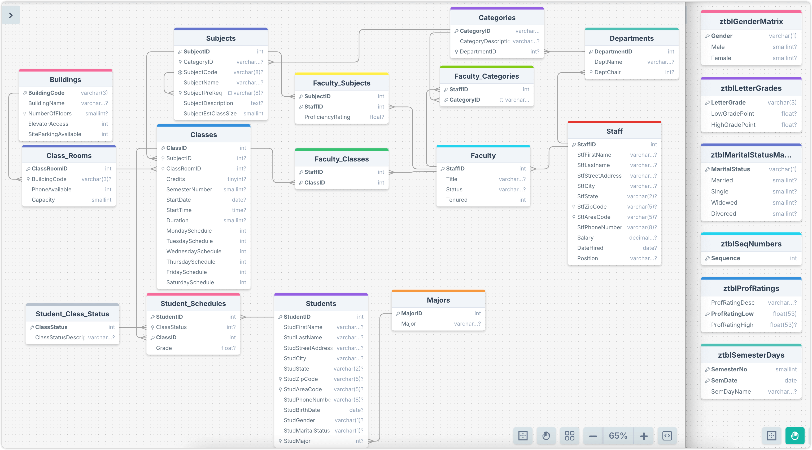

# SchoolSchedulingExample

SchoolSchedulingExample 是 `SQL 查询：从入门到实践（第４版）` 提供的示例数据库。

## 导入数据

使用 `schema.SQL` 文件导入建表语句，使用 `data.SQL` 导入数据。

`view.sql` 是书中提供的参考答案，以创建视图的形式保存在 SQL 文件中，可以参考，意义不大，也用不上。

> [!CAUTION]
> DrawSQL 疑似不支持 ADD CONSTRINAT 语句，可以删除该关键词，直接使用 Foreign Key 关键词。或者直接使用本文档同目录下[schema-for-drawsql-part-1.sql](./schema-for-drawsql-part-1.sql) 文件，它包含了主要的 15 张表，另外 [schema-for-drawsql-part-2.sql](./schema-for-drawsql-part-2.sql) 包含了其它的 5 张表，可以忽略，也可以使用两个画板来展示。

```sh
mysql -uroot -p12345 < "schema.SQL"
mysql -uroot -p12345 < "data.SQL"
```

导入数据到 Mysql 容器中，首先需要将文件拷贝到容器中：

```sh
docker exec -it container_name mysql -uroot -p12345 -t < /path/to/schema.SQL
docker exec -it container_name mysql -uroot -p12345 -t < /path/to/data.SQL
```

## ERD 关系图




左边重点大图访问 [Part-1](https://drawsql.app/teams/sql-404/diagrams/schoolscheduling-part-1)，右边小图无关紧要，可以访问 [Part-2](https://drawsql.app/teams/sql-404/diagrams/schoolscheduling-part-2)。

## 表字段注释

数据库包含 21 张表：

- `Subjects` 课程科目表，如数学，物理。
- `Classes` 课程安排表
  - `Credits` 学分，学完课程可以获得学分
- `Staff` 教职工信息表
- `Faculty` 教职工任职信息表
  - `Title` 任职信息，如教授，副教授，教授助手
  - `Status` 任职状态，离职还是在职
  - `Tenured` 是否终身任教
- `Faculty_Subjects` 教职工-课程科目表，教职工教习的科目
  - `ProficiencyRating`
- `Buildings` 存储学校建筑的信息。
  - `BuildingCode` 建筑的唯一代码。
  - `BuildingName` 建筑名称。
  - `NumberOfFloors` 楼层数。
  - `ElevatorAccess` 是否有电梯。
  - `SiteParkingAvailable` 是否有停车场。
- `Categories` 分类信息（可能是课程分类或其他类别）。
  - `CategoryID` 类别的唯一标识符。
  - `CategoryDescription` 类别描述。
  - `DepartmentID` 关联的部门 ID。
- `Class_Rooms` 教室信息。
  - `ClassRoomID` 教室的唯一标识符。
  - `BuildingCode` 关联的建筑代码。
  - `PhoneAvailable` 是否有电话。
  - `Capacity` 教室容量。
- `Classes` 课程信息。
  - `ClassID` 课程的唯一标识符。
  - `SubjectID` 关联的学科 ID。
  - `ClassRoomID` 关联的教室 ID。
  - `Credits` 课程学分。
  - `SemesterNumber` 学期号。
  - `StartDate` 开课日期。
  - `StartTime` 开课时间。
  - `Duration` 课程持续时间（分钟）。
  - `MondaySchedule` SaturdaySchedule: 标识课程在一周中的哪几天进行。
- `Departments`部门信息。
  - `DepartmentID` 部门的唯一标识符。
  - `DeptName` 部门名称。
  - `DeptChair` 部门负责人 ID。
- `Faculty` 教职员工信息。
  - `StaffID` 教职员工的唯一标识符。
  - `Title` 职位头衔。
  - `Status` 职位状态（例如全职、兼职）。
  - `Tenured` 是否获得终身教职。
- `Faculty_Categories` 教职员工与类别之间的关系。
  - `StaffID` 教职员工的唯一标识符。
  - `CategoryID` 类别的唯一标识符。
- `Faculty_Classes` 教职员工与课程之间的关系。
  - `ClassID` 课程的唯一标识符。
  - `StaffID` 教职员工的唯一标识符。
- `Faculty_Subjects` 教职员工与学科之间的关系。
  - `StaffID` 教职员工的唯一标识符。
  - `SubjectID` 学科的唯一标识符。
  - `ProficiencyRating` 教职员工在该学科的熟练度评分。
- `Majors` 专业信息。
  - `MajorID` 专业的唯一标识符。
  - `Major` 专业名称。
- `Staff` 员工个人信息。
  - `StaffID` 员工的唯一标识符。
  - `StfFirstName` 员工的名字。
  - `StfLastname` 员工的姓氏。
  - `StfStreetAddress` 街道地址。
  - `StfCity` 城市。
  - `StfState` 州。
  - `StfZipCode` 邮政编码。
  - `StfAreaCode` 电话区号。
  - `StfPhoneNumber` 电话号码。
  - `Salary` 薪资。
  - `DateHired` 入职日期。
  - `Position` 职位名称。
- `Student_Class_Status` 学生课程状态信息。
  - `ClassStatus` 课程状态的唯一标识符。
  - `ClassStatusDescription` 课程状态描述。
- `Student_Schedules` 学生课程安排。
  - `StudentID` 学生的唯一标识符。
  - `ClassID` 课程的唯一标识符。
  - `ClassStatus` 课程状态。
  - `Grade` 课程成绩。
- `Students` 学生个人信息。
  - `StudentID` 学生的唯一标识符。
  - `StudFirstName` 学生的名字。
  - `StudLastName` 学生的姓氏。
  - `StudStreetAddress` 街道地址。
  - `StudCity` 城市。
  - `StudState` 州。
  - `StudZipCode` 邮政编码。
  - `StudAreaCode` 电话区号。
  - `StudPhoneNumber` 电话号码。
  - `StudBirthDate` 出生日期。
  - `StudGender` 性别。
  - `StudMaritalStatus` 婚姻状况。
  - `StudMajor` 关联的专业 ID。
- `Subjects` 学科信息。
  - `SubjectID` 学科的唯一标识符。
  - `CategoryID` 关联的类别 ID。
  - `SubjectCode` 学科代码。
  - `SubjectName` 学科名称。
  - `SubjectPreReq` 学科先修要求。
  - `SubjectDescription` 学科描述。
  - `SubjectEstClassSize` 预计班级规模。
- `ztblGenderMatrix` 用于存储性别信息。
  - `Gender` 性别代码，如 'M' 表示男性，'F' 表示女性。
  - `Male` 男性数量或标识。
  - `Female` 女性数量或标识。
- `ztblLetterGrades` 用于存储成绩等级信息。
  - `LetterGrade` 字母成绩等级，如 'A'、'B'、'C'。
  - `LowGradePoint` 该成绩等级的最低分数。
  - `HighGradePoint` 该成绩等级的最高分数。
- `ztblMaritalStatusMatrix` 用于存储婚姻状况信息。
  - `MaritalStatus`婚姻状况代码，如 'M' 表示已婚，'S' 表示单身，'W' 表示丧偶，'D' 表示离婚。
  - `Married` 已婚人数或标识。
  - `Single` 单身人数或标识。
  - `Widowed` 丧偶人数或标识。
  - `Divorced` 离婚人数或标识。
- `ztblProfRatings` 用于存储教职员工在某一学科上的熟练度评分。
  - `ProfRatingDesc` 熟练度评分的描述，如 'Excellent'、'Good'。
  - `ProfRatingLow` 评分的最低值。
  - `ProfRatingHigh` 评分的最高值。
- `ztblSemesterDays` 用于存储学期内的每一天的信息。
  - `SemesterNo` 学期编号。
  - `SemDate` 学期中的具体日期。
  - `SemDayName` 该日期对应的星期几，如 'Monday'、'Tuesday'。
- `ztblSeqNumbers` 用于存储序列号信息，通常用于生成唯一的编号。
  - `Sequence` 序列号。

## 练习

<details style="padding: 8px 20px; margin-bottom: 20px; background-color: rgba(142, 150, 170, 0.14);">
<summary markdown="span">#8.4.1 使用内连接，列出周三上课的课程所属的科目</summary>

由于同一个课程的不同部分可能安排在同一天上课，因此我使用了关键字 DISTINCT 来消除重复行。

返回 34 条记录：

```sql
select distinct SubjectName
from Classes
inner join Subjects
on Classes.SubjectID = Subjects.SubjectID
where Classes.WednesdaySchedule = 1;
```

书中示例同上，可参考 view.sql 文件中 CH08_Subjects_On_Wednesday。

</details>
<details style="padding: 8px 20px; margin-bottom: 20px; background-color: rgba(142, 150, 170, 0.14);">
<summary markdown="span">#8.4.3 使用内连接，列出名字相同的学生和老师</summary>

返回 2 条记录：

```sql
select concat(Students.StudFirstName, ',', Students.StudLastName),
concat(Staff.StfFirstName, ',', Staff.StfLastname)
from Students
inner join Staff
on Students.StudFirstName = Staff.StfFirstName
```

书中示例同上，可参考 view.sql 文件中 CH08_Students_Staff_Same_FirstName。

</details>

<details style="padding: 8px 20px; margin-bottom: 20px; background-color: rgba(142, 150, 170, 0.14);">
<summary markdown="span">#8.6 使用内连接，显示所有的教学楼及其中的教室</summary>

返回 47 条记录：

```sql
select Buildings.BuildingName, Class_Rooms.ClassRoomID, Class_Rooms.Capacity
from Buildings
inner join Class_Rooms
on Class_Rooms.BuildingCode = Buildings.BuildingCode;
```

书中示例同上，可参考 view.sql 文件中的 CH08_Buildings_Classrooms

</details>
<details style="padding: 8px 20px; margin-bottom: 20px; background-color: rgba(142, 150, 170, 0.14);">
<summary markdown="span">#8.6 使用内连接，列出学生及其当前注册的课程</summary>

返回 50 条记录：

```sql
select
DISTINCT Student_Schedules.StudentID,
Student_Schedules.ClassID,
Classes.SubjectID
from Students
inner join Student_Schedules
on Students.StudentID = Student_Schedules.StudentID
inner join Classes
on Student_Schedules.ClassID = Classes.ClassID
inner join Subjects
on Classes.SubjectID = Subjects.SubjectID
inner join Student_Class_Status
on Student_Class_Status.ClassStatus = Student_Schedules.ClassStatus
where Student_Class_Status.ClassStatusDescription = 'Enrolled';
```

书中示例返回 50 行，可参考 view.sql 文件中的 CH08_Student_Enrollments:

```sql
SELECT
	Concat( Students.StudLastName, ', ', Students.StudFirstName ) AS StudentFullName,
	Classes.ClassID,
	Subjects.SubjectName
FROM
	(
		(
			(
				Students
				INNER JOIN Student_Schedules
				ON Students.StudentID = Student_Schedules.StudentID
			)
		)
		INNER JOIN Student_Class_Status
		ON Student_Schedules.ClassStatus = Student_Class_Status.ClassStatus
	)
INNER JOIN Classes
ON Classes.ClassID = Student_Schedules.ClassID
INNER JOIN Subjects
ON Subjects.SubjectID = Classes.SubjectID
WHERE Student_Class_Status.ClassStatusDescription = 'Enrolled';
```

</details>
<details style="padding: 8px 20px; margin-bottom: 20px; background-color: rgba(142, 150, 170, 0.14);">
<summary markdown="span">#8.6 使用内连接，列出教职工及其讲授的科目</summary>

教职工信息表 Staff 和教职工任职信息表 Facutly 是 1 对 1，任职信息表 Faculty 和学科科目 Subjects 是多读多关系，有一个中间表 Facutly_Subjects。简化下来就是教职工信息表 Staff 和学科是 1 对多的关系，就是 Staff 和 Faculty_Subjects 表。

将两张表内联就可以得到教职工和任教科目的练习，此时结果集和 Subjects 表的关系是多对一，适用 inner join，然后内连接匹配 ID 后就得到教学科目信息了。

返回 110 条记录：

```sql
select Staff.StfFirstName,Staff.StfLastname, Subjects.SubjectName
from Staff
-- 连不连 Faculty 可有可无，逻辑和实际查询都不影响结果
-- inner join Faculty -- [!code --]
-- on Faculty.StaffID = Staff.StaffID  -- [!code --]
inner join Faculty_Subjects
on Staff.StaffID = Faculty_Subjects.StaffID
inner join Subjects
on Subjects.SubjectID = Faculty_Subjects.SubjectID;
```

书中示例返回 110 条记录，可参考 view.sql 文件中的 CH08_Staff_Subjects:

```sql
SELECT
	Concat( Staff.StfLastname, ', ', Staff.StfFirstName ) AS StfFullName,
	Subjects.SubjectName
FROM
	(
		Staff
		INNER JOIN Faculty_Subjects
		ON Staff.StaffID = Faculty_Subjects.StaffID
	)
INNER JOIN Subjects
ON Subjects.SubjectID = Faculty_Subjects.SubjectID;
```

</details>
<details style="padding: 8px 20px; margin-bottom: 20px; background-color: rgba(142, 150, 170, 0.14);">
<summary markdown="span">#8.6 使用内连接，列出艺术和计算机课程的成绩都不低于 85 分的学生</summary>

将需求拆分，查询出艺术分不低于 85 的学生，和计算机不低于 85 分的学生，然后使用 inner join 取交集。

返回 1 条记录：

```sql
select Students.StudFirstName, Students.StudLastName
from Students
inner join Student_Schedules
on Students.StudentID =Student_Schedules.StudentID
inner join Classes
on Classes.ClassID = Student_Schedules.ClassID
inner join Subjects
on Classes.SubjectID = Subjects.SubjectID
where Subjects.SubjectName = 'Computer Art' and Student_Schedules.Grade > 85;
```

书中示例返回 1 条记录，可参考 view.sql 文件中的 CH08_Good_Art_CS_Students:

```sql
SELECT
	StudArt.StudFullName
FROM
	(
	SELECT DISTINCT
		Students.StudentID,
		Concat( Students.StudLastName, ', ', Students.StudFirstName ) AS StudFullName
	FROM
		(((
					Students
					INNER JOIN Student_Schedules ON Students.StudentID = Student_Schedules.StudentID
					)
				INNER JOIN Classes ON Classes.ClassID = Student_Schedules.ClassID
				)
			INNER JOIN Subjects ON Subjects.SubjectID = Classes.SubjectID
		)
		INNER JOIN Categories ON Categories.CategoryID = Subjects.CategoryID
	WHERE
		Categories.CategoryDescription = 'Art'
		AND Student_Schedules.Grade >= 85
	) StudArt
	INNER JOIN (
		SELECT DISTINCT Student_Schedules.StudentID
		FROM
		(
			(
				Student_Schedules
				INNER JOIN Classes
				ON Classes.ClassID = Student_Schedules.ClassID
			)
			INNER JOIN Subjects
			ON Subjects.SubjectID = Classes.SubjectID
		)
		INNER JOIN Categories
		ON Categories.CategoryID = Subjects.CategoryID
		WHERE Categories.CategoryDescription LIKE '%Computer%'
		AND Student_Schedules.Grade >= 85
	) AS StudCS
	ON StudArt.StudentID = StudCS.StudentID;
```

</details>

<details style="padding: 8px 20px; margin-bottom: 20px; background-color: rgba(142, 150, 170, 0.14);">
<summary markdown="span">#9.5 使用外连接，列出没有讲授任何课程的教职工</summary>

有没有课程不是看教职工教授的科目，而是看教室安排。

返回 5 条记录：

```sql
select Staff.StaffID, Staff.StfFirstName, Staff.StfLastname
from Staff
left join
Faculty_Classes
on Faculty_Classes.StaffID = Staff.StaffID
where Faculty_Classes.ClassID is NULL;
```

书中示例同上，可参考 view.sql 文件中 CH09_Staff_Not_Teaching。

</details>
<details style="padding: 8px 20px; margin-bottom: 20px; background-color: rgba(142, 150, 170, 0.14);">
<summary markdown="span">#9.5 使用外连接，显示从未退过课的学生</summary>

先分许需求，又是经典的多对多模型，Students 和 Classes 多对多，并且用了一张中间表 Students_Schedules。由于多表连续 left join 只能在 1 对多的情况下不会出现意外情况，所以 `Students left join Students_Schedules` 之后无法继续 `left join Clesses`。于是将多对一的 `Students_Schedules` 和 `Classes` 先内连接起来，`Students` 和它们的结果集 还是 1 对多的关系，可以 left jion。

返回 16 条记录：

```sql
select StudFirstName,StudLastName
from Students
left join (
	select Student_Schedules.StudentID, Student_Schedules.ClassID
	from Student_Schedules
	inner join Student_Class_Status
	on Student_Schedules.ClassStatus = Student_Class_Status.ClassStatus
	where Student_Class_Status.ClassStatusDescription = 'Withdrew'
) as A
on Students.StudentID = A.StudentID
where A.ClassID is NULL;
```

书中示例同上，可参考 view.sql 文件中 CH09_Students_Never_Withdrawn。

</details>
<details style="padding: 8px 20px; margin-bottom: 20px; background-color: rgba(142, 150, 170, 0.14);">
<summary markdown="span">#9.5 使用外连接，列出所有的科目类别及其所有课程</summary>

需求分析，简单的 1 对多，1 对多关系，完全可以多表左外连接 left join。

返回 145 条记录：

```sql
select
CategoryDescription, Subjects.SubjectName, ClassRoomID,
Classes.StartDate, Classes.StartTime, Classes.Duration
from  Categories
left join Subjects
on Categories.CategoryID = Subjects.CategoryID
left join Classes
on Subjects.SubjectID = Classes.SubjectID
```

书中示例，返回 145 条记录，可参考 view.sql 文件中 CH09_All_Categories_All_Subjects_Any_Classes：

```sql
SELECT
	Categories.CategoryDescription,
	Subjects.SubjectName,
	Classes.ClassroomID,
	Classes.StartDate,
	Classes.StartTime,
	Classes.Duration
FROM (
	Categories
	LEFT OUTER JOIN Subjects
	ON Categories.CategoryID = Subjects.CategoryID
)
LEFT OUTER JOIN Classes ON Subjects.SubjectID = Classes.SubjectID
```

</details>
<details style="padding: 8px 20px; margin-bottom: 20px; background-color: rgba(142, 150, 170, 0.14);">
<summary markdown="span">#9.7 使用外连接，列出没有学生注册的课程</summary>

返回 118 条记录：

```sql
select Classes.ClassID, SubjectName
from Subjects
inner join Classes
on Classes.SubjectID = Subjects.SubjectID
left JOIN(
	select Student_Schedules.ClassID
	from Student_Schedules
	inner join Student_Class_Status
	on Student_Schedules.ClassStatus = Student_Class_Status.ClassStatus
	where Student_Class_Status.ClassStatusDescription = 'Enrolled'
) AS ClassStatus
on Classes.ClassID = ClassStatus.ClassID
where ClassStatus.ClassID is NULL;
```

书中示例如上，可参考 view.sql 文件中的 CH09_Classes_No_Students_Enrolled

</details>
<details style="padding: 8px 20px; margin-bottom: 20px; background-color: rgba(142, 150, 170, 0.14);">
<summary markdown="span">#9.7 使用外连接，列出没有学生注册的课程</summary>

返回 1 条记录：

```sql
select Subjects.SubjectID, Subjects.SubjectName
from Subjects
left join Faculty_Subjects
on Subjects.SubjectID = Faculty_Subjects.SubjectID
where Faculty_Subjects.StaffID is NULL;
```

书中示例如上，可参考 view.sql 文件中的 CH09_Subjects_No_Faculty

</details>
<details style="padding: 8px 20px; margin-bottom: 20px; background-color: rgba(142, 150, 170, 0.14);">
<summary markdown="span">#9.7 使用外连接，列出当前未注册任何课程的学生</summary>

返回 2 行条记录：

```sql
select Students.StudentID, Students.StudFirstName, Students.StudLastName
from Students
left join (
	select Student_Schedules.StudentID
	from Student_Schedules
	inner join Student_Class_Status
	on Student_Schedules.ClassStatus = Student_Class_Status.ClassStatus
	where Student_Class_Status.ClassStatusDescription = 'Enrolled'
) as A
on Students.StudentID = A.StudentID
where A.StudentID is NULl;
```

书中示例如上，可参考 view.sql 文件中的 CH09_Students_Not_Currently_Enrolled

</details>

<details style="padding: 8px 20px; margin-bottom: 20px; background-color: rgba(142, 150, 170, 0.14);">
<summary markdown="span">#9.7 使用外连接，显示所有的教员及其讲授的课程</summary>

返回 135 行条记录：

```sql
select Staff.StaffID, Staff.StfFirstName, Staff.StfLastname
from Staff
left join (
	Subjects
	inner join Classes
	on Subjects.SubjectID = Classes.SubjectID
	inner join Faculty_Classes
	on Classes.ClassID = Faculty_Classes.ClassID
)
on Staff.StaffID = Faculty_Classes.StaffID
```

书中示例如上，可参考 view.sql 文件中的 CH09_All_Faculty_And_Any_Classes

</details>

<details style="padding: 8px 20px; margin-bottom: 20px; background-color: rgba(142, 150, 170, 0.14);">
<summary markdown="span">#10.4 使用 union，显示艺术课成绩不低于 85 的学生以及讲授艺术课且评分不低于 9 的教员</summary>

书中示例，返回 12 条记录，可参考 view.sql 文件中 CH10_Good_Art_Students_And_Faculty：

```sql
SELECT
	Students.StudFirstName AS FirstName,
	Students.StudLastName AS LastName,
	Student_Schedules.Grade AS Score,
	'Student' AS Type
FROM (
	(
		(
			Students
			INNER JOIN Student_Schedules ON Students.StudentID = Student_Schedules.StudentID
		)
		INNER JOIN Student_Class_Status ON Student_Class_Status.ClassStatus = Student_Schedules.ClassStatus
	)
	INNER JOIN Classes ON Classes.ClassID = Student_Schedules.ClassID
)
INNER JOIN Subjects ON Subjects.SubjectID = Classes.SubjectID
WHERE Student_Class_Status.ClassStatusDescription = 'Completed'
AND Student_Schedules.Grade >= 85
AND Subjects.CategoryID = 'ART'
UNION
SELECT
	Staff.StfFirstName,
	Staff.StfLastName,
	Faculty_Subjects.ProficiencyRating AS Score,
	'Faculty' AS Type
FROM (
		Staff
		INNER JOIN Faculty_Subjects
		ON Staff.StaffID = Faculty_Subjects.StaffID
)
INNER JOIN Subjects
ON Subjects.SubjectID = Faculty_Subjects.SubjectID
WHERE Faculty_Subjects.ProficiencyRating > 8
AND Subjects.CategoryID = 'ART'
```

</details>

<details style="padding: 8px 20px; margin-bottom: 20px; background-color: rgba(142, 150, 170, 0.14);">
<summary markdown="span">#11.5.1 列表达式中使用标量子查询，显示所有的科目及其包含的在周一上课的课程的数量</summary>

书中示例，返回 56 条记录，可参考 view.sql 文件中 CH11_Subjects_Monday_Count：

```sql
SELECT
	Subjects.SubjectName,
	( SELECT COUNT(*) FROM Classes
		WHERE MondaySchedule = 1
		AND Classes.SubjectID = Subjects.SubjectID
	)
	AS MondayCount
FROM Subjects;
```

</details>

<details style="padding: 8px 20px; margin-bottom: 20px; background-color: rgba(142, 150, 170, 0.14);">
<summary markdown="span">#11.5.2 筛选器中使用子查询，显示从未退过课的学生</summary>

书中示例，返回 16 条记录，可参考 view.sql 文件中 CH11_Students_Never_Withdrawn：

```sql
SELECT StudentID, StudFirstName, StudLastName
FROM Students
WHERE Students.StudentID NOT IN (
	SELECT Student_Schedules.StudentID
  FROM Student_Schedules
  INNER JOIN Student_Class_Status
  ON Student_Schedules.ClassStatus = Student_Class_Status.ClassStatus
  WHERE Student_Class_Status.ClassStatusDescription = 'Withdrew'
);
```

</details>
