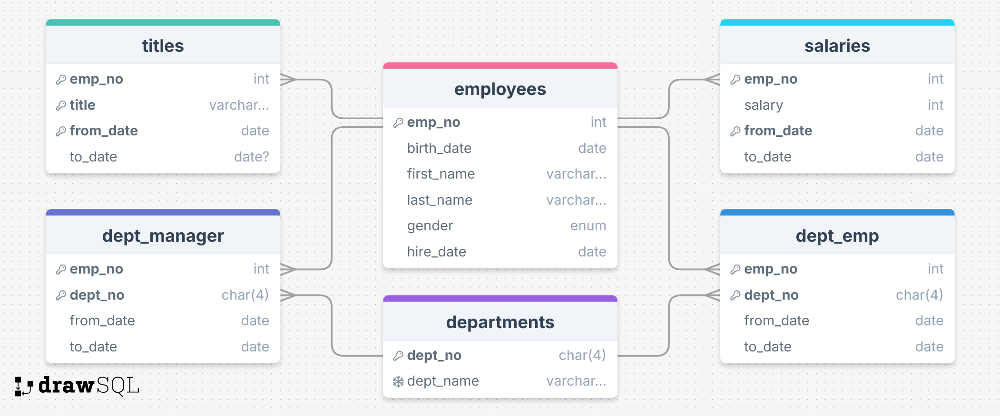

# employees

employees 的 SQL 文件存在于 [test_db 仓库](https://github.com/datacharmer/test_db)，可以直接 clone 仓库到目录，或者下载 仓库的 ZIP 压缩，又或者下载 Release 压缩包。

employees 的 SQL 文件偏多，包含主入口文件 `employees.sql` 文件，以及其它的数据文件，还有包含数据校验的 SQL 文件等，就不一一列举了。

## 导入数据

首先需要下载文件到 Mysql 服务运行所在的服务器上，解压 SQL 文件目录到 `/path/to/test_db`:

```sh
cd /path/to/test_db
```

一定要进入到所有 SQL 文件所在的目录，由于主入口文件 `employees.sql` 文件使用 `source 命令` 导入 SQL 文件，所以需要确保目录正确才能正常执行。

```sh
mysql -uroot -p12345 < employees.sql
```

会输出 7 个 INFO 表格以及 data_load_time_diff 表格，如果没有正常输出，则可能存在路径错误。

导入数据到 Mysql 容器中，首先需要将文件拷贝到容器中：

```sh
docker cp /path/to/test_db contianer_name:/tmp/test_db
docker exec -it sh container_name sh
mysql -uroot -p12345
cd /tmp/test/db
mysql -uroot -p12345 -t < employees.sql
```

::: details 校验数据

需要在 `/path/to/test_db` 目录下：

```sh
cd /path/to/test_db
```

SHA 校验：

```sh
mysql -uroot -p12345 -t < test_employees_sha.sql
```

校验时间可能较长，耐心等待，结果如下：

```
+----------------------+
| INFO                 |
+----------------------+
| TESTING INSTALLATION |
+----------------------+
+--------------+------------------+------------------------------------------+
| table_name   | expected_records | expected_crc                             |
+--------------+------------------+------------------------------------------+
| departments  |                9 | 4b315afa0e35ca6649df897b958345bcb3d2b764 |
| dept_emp     |           331603 | d95ab9fe07df0865f592574b3b33b9c741d9fd1b |
| dept_manager |               24 | 9687a7d6f93ca8847388a42a6d8d93982a841c6c |
| employees    |           300024 | 4d4aa689914d8fd41db7e45c2168e7dcb9697359 |
| salaries     |          2844047 | b5a1785c27d75e33a4173aaa22ccf41ebd7d4a9f |
| titles       |           443308 | d12d5f746b88f07e69b9e36675b6067abb01b60e |
+--------------+------------------+------------------------------------------+
+--------------+------------------+------------------------------------------+
| table_name   | found_records    | found_crc                                |
+--------------+------------------+------------------------------------------+
| departments  |                9 | 4b315afa0e35ca6649df897b958345bcb3d2b764 |
| dept_emp     |           331603 | d95ab9fe07df0865f592574b3b33b9c741d9fd1b |
| dept_manager |               24 | 9687a7d6f93ca8847388a42a6d8d93982a841c6c |
| employees    |           300024 | 4d4aa689914d8fd41db7e45c2168e7dcb9697359 |
| salaries     |          2844047 | b5a1785c27d75e33a4173aaa22ccf41ebd7d4a9f |
| titles       |           443308 | d12d5f746b88f07e69b9e36675b6067abb01b60e |
+--------------+------------------+------------------------------------------+
+--------------+---------------+-----------+
| table_name   | records_match | crc_match |
+--------------+---------------+-----------+
| departments  | OK            | ok        |
| dept_emp     | OK            | ok        |
| dept_manager | OK            | ok        |
| employees    | OK            | ok        |
| salaries     | OK            | ok        |
| titles       | OK            | ok        |
+--------------+---------------+-----------+
+------------------+
| computation_time |
+------------------+
| 00:00:47         |
+------------------+
+---------+--------+
| summary | result |
+---------+--------+
| CRC     | OK     |
| count   | OK     |
+---------+--------+
```

MD5 校验：

```sh
mysql -uroot -p12345 -t < test_employees_md5.sql
```

校验时间可能较长，耐心等待，结果如下：

```
+----------------------+
| INFO                 |
+----------------------+
| TESTING INSTALLATION |
+----------------------+
+--------------+------------------+----------------------------------+
| table_name   | expected_records | expected_crc                     |
+--------------+------------------+----------------------------------+
| departments  |                9 | d1af5e170d2d1591d776d5638d71fc5f |
| dept_emp     |           331603 | ccf6fe516f990bdaa49713fc478701b7 |
| dept_manager |               24 | 8720e2f0853ac9096b689c14664f847e |
| employees    |           300024 | 4ec56ab5ba37218d187cf6ab09ce1aa1 |
| salaries     |          2844047 | fd220654e95aea1b169624ffe3fca934 |
| titles       |           443308 | bfa016c472df68e70a03facafa1bc0a8 |
+--------------+------------------+----------------------------------+
+--------------+------------------+----------------------------------+
| table_name   | found_records    | found_crc                        |
+--------------+------------------+----------------------------------+
| departments  |                9 | d1af5e170d2d1591d776d5638d71fc5f |
| dept_emp     |           331603 | ccf6fe516f990bdaa49713fc478701b7 |
| dept_manager |               24 | 8720e2f0853ac9096b689c14664f847e |
| employees    |           300024 | 4ec56ab5ba37218d187cf6ab09ce1aa1 |
| salaries     |          2844047 | fd220654e95aea1b169624ffe3fca934 |
| titles       |           443308 | bfa016c472df68e70a03facafa1bc0a8 |
+--------------+------------------+----------------------------------+
+--------------+---------------+-----------+
| table_name   | records_match | crc_match |
+--------------+---------------+-----------+
| departments  | OK            | ok        |
| dept_emp     | OK            | ok        |
| dept_manager | OK            | ok        |
| employees    | OK            | ok        |
| salaries     | OK            | ok        |
| titles       | OK            | ok        |
+--------------+---------------+-----------+
+------------------+
| computation_time |
+------------------+
| 00:00:47         |
+------------------+
+---------+--------+
| summary | result |
+---------+--------+
| CRC     | OK     |
| count   | OK     |
+---------+--------+
```

:::

## 员工管理数据库业务流程介绍

## ERD 关系图




或者访问 [drawsql](https://drawsql.app/teams/sql-404/diagrams/employees)，查看详细 ERD 图。
