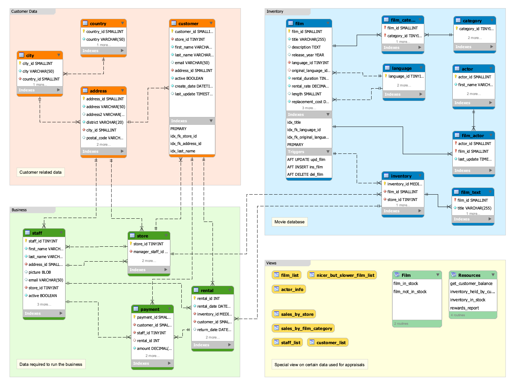
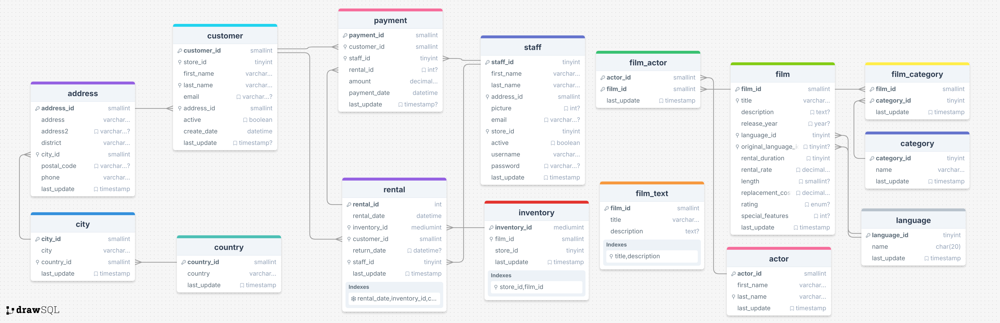

# Sakila

Sakila 数据库的 SQL 文件已经存在于同目录中，或者你也可以进入 [下载地址](https://dev.mysql.com/doc/index-other.html)，查找 sakila 数据库的 SQL 文件进行下载。

关于 sakila 数据库的使用方法和教程可以参考本文档，也可以参考 [Mysql 官方文档示例](https://dev.mysql.com/doc/sakila/en/)。

sakila 数据的文件如下，当前提供的 sakila SQL 文件版本为 [1.5](https://dev.mysql.com/doc/sakila/en/sakila-news.html#sakila-news-1-5)：

```
├── sakila-data.sql
├── sakila-schema.sql
└── sakila.mwb
```

- `sakila-schema.sql` 是建表语句
- `sakila-data.sql` 是插入数据的语句
- `sakila.mwb` 是 Mysql Workbench 数据模型文件，可以导入该模型文件，查看数据库的 ERD 关系图

## 导入数据

在 Mysql 容器中导入数据：

```sh
# 建表
docker exec -i mysql_contianer mysql -uroot -p12345 -- \
< ./sakila-schema.sql
# 导入数据
docker exec -i mysql_container mysql -uroot -p12345 -- \
< ./sakila-data.sql
```

登陆 Mysql 服务器，导入服务器上的 SQL 文件

```sh
mysql -uroot -p12345
# 设置字符编码
set names utf8
source /path/to/sakila-schema.sql
source /path/to/sakila-data.sql
```

如果是在容器中使用 source，则还需要将文件拷贝到容器中

```sh
docker cp /path/to/sakila-schema.sql \
mysql_containre:/path/tosakila-schema.sql
```

## ERD 关系图




或者访问 [drawsql](https://drawsql.app/teams/sql-404/diagrams/sakila/embed)，查看详细 ERD 图。

## sakila DVD 业务流程介绍

sakila 数据库主要描述了 DVD 租赁系统的业务流程，列举其中关键点

- 每个商店 store 维护自己的的租赁影片清单 inventory，当客户 customer 取走/归还 DVD 时会有专门的店员对这个影片清单 inventory 进行维护
- 影片的分类 file_category，原语言 language，语言，演员等信息。
- 客户 customer 必须在商店注册之后才有才可以租赁 rental
- 客户 customer 可以在任意一家商店 store 租赁 rental 影片，店员会维护 影片清单 inventory
- 客户 customer 可以在任意时间进行付费 payment

## 参考

- [博客园（VNX）：MySQL Sakila 样本数据库](https://www.cnblogs.com/chinas/p/6547366.html)
- [博客园（MySQL 技术）：MySQL 示例数据库大全 ](https://www.cnblogs.com/mysqljs/p/18243559)
